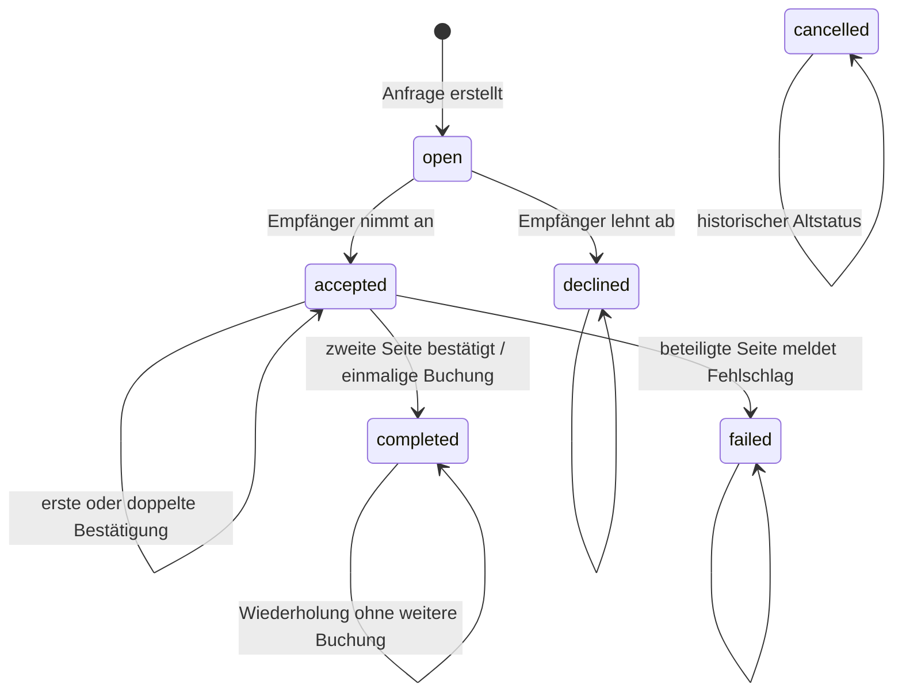

# S02 – Papierlisten- und Tradeflow-Regressionstests

| Feld | Wert |
| --- | --- |
| Status | abgeschlossen |
| Stand | 2026-07-28 |
| Verbindliche Grundlage | [Development Roadmap V1, Sprint S02](development-roadmap-v1.md#s02--papierlisten--und-tradeflow-regressionstests) |
| Abhängigkeiten | [S00-Referenzfixture](s00-reference-and-test-data.md), [S01-Bestandstests](s01-inventory-regression-tests.md) |
| Anwendungscode | unverändert |
| Datenbankschema | unverändert |

Diese Notiz dokumentiert ausschließlich die Regressionstests für den heute
vorhandenen Papierlisten- und Tradeflow. Sie definiert keinen neuen
Trade-Lifecycle.

## Testbefehl

Vom Repository-Wurzelverzeichnis:

```sh
python3 -m unittest discover -s tests -p 'test_s02_*.py' -v
```

Der Befehl führt ausschließlich S02 aus und benötigt keine zusätzliche
Testabhängigkeit.

## Testdaten und Isolation

Jeder Test startet mit einer eigenen temporären Kopie von
`App/Database/sammlr_reference_s00.db`.

Der synthetische VFL-Fall verwendet:

- Nutzer 1 mit Code `1` in Menge `3` und fehlendem Code `3`,
- Nutzer 2 mit fehlendem Code `1` und Code `3` in Menge `2`,
- ein manuelles Paket `give_codes=["1"]`, `get_codes=["3"]`,
- den bereits in S00 vorhandenen abgeschlossenen Referenztrade,
- ausschließlich innerhalb des jeweiligen Tests erzeugte zusätzliche
  `open`-, `accepted`-, `declined`-, `failed`-, `completed`- oder
  `cancelled`-Datensätze.

Isolation:

1. Vor dem Import von `App/webapp.py` wird `DATABASE_PATH` auf eine
   temporäre Bootstrap-Kopie gesetzt.
2. Vor jedem Test wird eine neue Fixture-Kopie erzeugt.
3. `webapp.DB` zeigt nur auf diese Testdatei.
4. Sitzungen wechseln explizit zwischen den synthetischen Nutzern 1, 2 und 3.
5. Nach jedem Test wird die SHA-256-Prüfsumme von
   `App/Database/sammlr.db` gegen den Wert vor dem Testlauf geprüft.
6. Die temporäre Datenbank wird nach dem Test verworfen.

## Ist-State-Diagramm



Der Papierlistentransfer liegt außerhalb dieser Statusfolge. Er bucht die
ausgewählten Zu-/Abgänge unmittelbar für den aktuellen Nutzer und erzeugt
keine `trade_requests`-Zeile.

## Regression-Matrix

| Nr. | Fall | Normal/Randfall | Geschütztes Verhalten |
| ---: | --- | --- | --- |
| 1 | Papierlisten-Zusammenstellung | normal | Code `3` einmal erhalten; Code `1` zweimal abgebbar |
| 2 | Papierlisten-Transfer | normal | Nutzer 1 gibt `1` ab, erhält `3`; Partnerbestand und Trade-Tabelle bleiben unverändert |
| 3 | Papierlisten-Übermenge | Randfall | drei Abgaben bei nur zwei Doppelten werden vollständig abgelehnt |
| 4 | Trade-Anfrage erstellen | normal | manuelles Paket wird `open`, unbestätigt und ohne Bestandsbuchung gespeichert |
| 5 | ungültige Anfrage | Randfall | ungültiger Code, nicht verfügbarer Code und leere Seite erzeugen keinen Trade |
| 6 | Annahme | normal/Berechtigung | nur Empfänger kann `open → accepted` auslösen; Flags starten bei `0/0` |
| 7 | Ablehnung | normal | Empfänger setzt `declined`; keine Bestandsänderung |
| 8 | erste Bestätigung | normal | eine Flagge wird `1`; Status bleibt `accepted`; keine Buchung |
| 9 | doppelte erste Bestätigung | Randfall | Flag bleibt `1`; keine Buchung |
| 10 | zweite Bestätigung | normal | Status wird `completed`; beide Flags stehen auf `1` |
| 11 | beidseitige Bestandsbuchung | normal | beide Nutzer geben und erhalten exakt eine Kopie; Doppelte stimmen |
| 12 | wiederholter Abschluss | Randfall | weitere Confirm-Aufrufe ändern weder Status noch Bestände |
| 13 | Fehlschlag | normal | `accepted → failed`; Bestände bleiben vollständig unverändert |
| 14 | unberechtigter Zugriff | Randfall | Nutzer 3 kann Detail, Annahme, Bestätigung und Fehlschlag nicht ausführen |
| 15 | unbekannte Trade-ID | Randfall | Accept, Decline, Confirm und Fail verändern nichts |
| 16 | Historie und Altstatus | normal/Randfall | Archiv zeigt nur abgeschlossene Trades; `failed` und separates `cancelled` bleiben außen vor |

Die schreibenden Tests prüfen Route, Zustandszeile und beide
Bestandsseiten direkt in SQLite. Beim Abschluss werden alle vier betroffenen
Nutzer-/Code-Kombinationen einschließlich `duplicates` assertiert.

## Genau-einmal-Buchung

Nach einem erfolgreichen Trade wird folgender Zustand erwartet:

| Nutzer | Code | Menge | Doppelte |
| ---: | --- | ---: | ---: |
| 1 | `1` | 2 | 1 |
| 1 | `3` | 1 | 0 |
| 2 | `1` | 1 | 0 |
| 2 | `3` | 1 | 0 |

Weitere Bestätigungen nach `completed` müssen exakt diesen Zustand erhalten.

## Mutationsnachweis

Für den geforderten Negativnachweis:

```sh
SAMMLR_S02_MUTATE_COMPLETION=1 \
python3 -m unittest discover -s tests -p 'test_s02_*.py' -v
```

Die Umgebungsvariable ersetzt `complete_trade()` ausschließlich im Speicher
des Testprozesses durch eine Variante, die zweimal bucht. Keine
Anwendungsdatei wird geändert.

Bestätigtes Ergebnis:

- Exit-Code `1`,
- 16 ausgeführte Tests,
- 2 fehlgeschlagene Abschluss-/Genau-einmal-Tests,
- sichtbare Doppelbuchung auf beiden Bestandsseiten.

Der unveränderte Referenzzustand läuft mit 16 von 16 Tests grün.

## Bewusste Nichtabdeckung

Nicht getestet oder implementiert wurden:

- Nebenwirkungs-, Trophy- und Notification-Vollständigkeit aus S03,
- Reservierungen,
- Versand- oder Empfangsstatus,
- Fristen und Eskalationen,
- Teilempfang und Problemfälle,
- Trade Lifecycle 2.0,
- Inventory-Service oder zentrale Inventory-Architektur,
- Navigation, UI, CSS und JavaScript,
- Migrationen oder Schemaänderungen.

## Minimale technische Anpassungen

Am Anwendungscode waren keine Anpassungen notwendig.

Erstellt wurde ausschließlich eine zweite `unittest`-Datei in der bereits
durch S01 vorhandenen Teststruktur. Die S00-Isolationsstrategie wurde
wiederverwendet, ohne S01 umzubauen.

## Offene Beobachtungen für spätere Sprints

Nicht umgesetzt wurden:

- Der Papierlistentransfer ist eine unmittelbare, einseitige Bestandsbuchung
  ohne Trade-Statuszeile; der Anfrageflow ist davon getrennt.
- Anfragebestände werden geprüft, aber im heutigen Flow nicht reserviert.
- Nicht berechtigte oder nicht passende Statusaktionen antworten überwiegend
  mit einem Redirect statt mit einem expliziten Fehlerstatus.
- Ein `failed`-Trade behält bereits gesetzte Bestätigungsflags bei.
- Das Profilarchiv zeigt ausschließlich `completed`; `failed`, `declined` und
  der historische Status `cancelled` werden nicht dargestellt.
- Alte GET-Kompatibilitätsrouten leiten nur auf Bedienhinweise weiter.
- Vollständige Trophy- und Notification-Nebenwirkungsprüfungen gehören gemäß
  Roadmap in S03 und wurden nicht vorgezogen.

## Abschluss

S02 ist abgeschlossen: Papierlistentransfer, manuelles Dealpaket, Anfrage,
Annahme, Ablehnung, beide Bestätigungen, beidseitige Genau-einmal-Buchung,
`completed`, `failed`, Berechtigungsfehler und bestehende Historie sind gegen
unabhängige Fixture-Kopien geschützt. Anwendungscode, sichtbares Verhalten
und Datenbankschema blieben unverändert.

