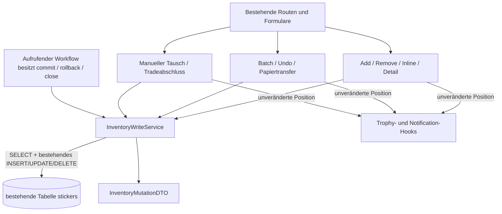

# S10 – InventoryWriteService und Schreibpfad-Inventar

Stand: 2026-08-01
Status: verbindlicher Adaptervertrag auf dem aktuellen Schema
Grundlagen: S01-Regressionen, S08 Inventory Contract V1 und S09 Read Service

## 1. Zweck und Sprintgrenze

Der `InventoryWriteService` ist der einzige Adapter für bestehende Änderungen
von `stickers.quantity` und `stickers.duplicates`. Er zentralisiert die schon
vor S10 vorhandene Mechanik, ohne sie fachlich neu zu definieren.

S10 führt ausdrücklich nicht ein:

- Reservierungen oder reservierungsbewusste Verfügbarkeit,
- Inventory Guards oder neue Fehlercodes,
- neue Transaktions-, Konflikt- oder Retry-Logik,
- neue Tabellen, Spalten, APIs oder UI,
- Änderungen an Trophy- oder Notification-Hooks.

## 2. Architekturdiagramm



Der Service löst keine Hooks aus und beendet keine Transaktion. Dadurch bleiben
Batch-, Undo-, Papierlisten- und Tradebuchungen weiterhin genau in ihren
bisherigen Transaktionsgrenzen.

## 3. Öffentliche Adapter-API

Der Dienst liegt in `App/services/inventory_write.py`.

```python
service = InventoryWriteService(connection)

service.set_quantity(user_id, album_id, sticker_code, quantity)
service.change_quantity(user_id, album_id, sticker_code, delta)
service.add(user_id, album_id, sticker_code, amount=1)
service.remove(user_id, album_id, sticker_code, amount=1)
```

Alle vier Methoden liefern ein unveränderliches `InventoryMutationDTO` mit:

- fachlicher Identität (`user_id`, `album_id`, `sticker_code`),
- `previous_quantity`,
- resultierender `quantity` und gespeichertem `duplicates`,
- `created`, `deleted` und der abgeleiteten Eigenschaft `changed`.

Das DTO ist eine technische Rückgabe für vorhandene Adapter. Es ist keine neue
API und verändert kein sichtbares Antwortformat.

## 4. Unveränderte Legacy-Regeln

| Ausgangslage und Command | Ergebnis |
| --- | --- |
| vorhandene Zeile, positives/negatives Delta | `quantity = max(alt + delta, 0)` |
| vorhandene Zeile mit Ergebnismenge über null | `duplicates = max(quantity - 1, 0)` |
| vorhandene Zeile mit Ergebnismenge null | Zeile wird gelöscht |
| fehlende Zeile, positives Delta | Zeile wird mit `status = owned` angelegt |
| fehlende Zeile, Delta null oder negativ | keine Zeile wird angelegt |
| `add`/`remove` mit negativem `amount` | Betrag wird wie bisher auf null begrenzt |
| `set_quantity` mit negativem Wert | Wert wird wie bisher auf null begrenzt |

Eine Golden-Master-relevante Legacy-Eigenheit bleibt absichtlich erhalten:
Legt `change_quantity` eine fehlende Zeile mit einem Delta größer als eins an,
wird zunächst `quantity = delta`, aber `duplicates = 0` gespeichert. S10
normalisiert diesen Altfall nicht. Eine Änderung daran wäre Produkt- oder
Validierungslogik außerhalb des Adapter-Sprints.

## 5. Konsolidiertes Schreibpfad-Inventar

| Schreibpfad | Route/Funktion | S10-Delegation | Hooks/Transaktion |
| --- | --- | --- | --- |
| Sticker hinzufügen | `add` | `InventoryWriteService.add` | unverändert in Route |
| Sticker entfernen | `remove` | `remove_sticker_quantity` → Service | unverändert in Route |
| Inline `+/-` | `update_sticker_quantity_inline` | `change_sticker_quantity` → Service | unverändert in Route |
| Mengenfeld im Detail | `sticker_detail` | `set_quantity` | unverändert in Route |
| Batch hinzufügen | `bulk_add` | je Code `add_sticker_quantity` → Service | ein bestehender Commit, Hooks danach |
| Batch entfernen | `bulk_remove` | je Code `remove_sticker_quantity` → Service | ein bestehender Commit, Hooks danach |
| Undo Add/Remove/Batch | `undo_last_action` | inverse Add-/Remove-Adapter | bestehende Session und ein Commit |
| Papierlisten-Transfer | `stickerliste_trade` | bestehende Wrapper → Service | Validierung, Session-Undo und Hooks unverändert |
| manueller Albumtausch | POST `albumseite` | `remove` und `add` | ein bestehender Commit, Hooks danach |
| bestätigter Tradeabschluss | `complete_trade` | bestehende Wrapper → Service | Status, Notifications und äußerer Commit unverändert |

Die Kompatibilitätsfunktionen `change_sticker_quantity`,
`add_sticker_quantity` und `remove_sticker_quantity` bleiben bestehen. Alte
Aufrufer und die S01-/S02-Mutationsnachweise behalten dadurch ihre bisherigen
Einstiegspunkte.

## 6. Bewusst ausgenommene direkte Mutation

Im aktiven `App/webapp.py` verbleibt genau eine direkte Sticker-DML-Anweisung:

```sql
DELETE FROM stickers WHERE user_id=?
```

Sie gehört zur vollständigen Kontolöschung `profil_delete`, nicht zu einer
Bestandsmengenänderung. Der Workflow löscht gemeinsam Benutzerkonto,
Albumzuordnungen, Trophäen, Trades und Notifications. Ihn über einzelne
Mengencommands zu leiten würde fachfremdes Verhalten und eine unnötige
Umstrukturierung erzeugen. Diese Ausnahme ist daher für S10 bewusst begründet.

Archiv- und Rescue-Dateien sind historische Kopien, keine aktiven
Anwendungsschreibpfade, und wurden nicht verändert.

## 7. Transaktion und konkurrierende Aufrufer

Der aufrufende Workflow besitzt weiterhin `commit`, `rollback` und `close`.
Mehrere Commands können deshalb wie bisher atomar in einer Papierlisten-,
Batch-, Undo- oder Trade-Transaktion ausgeführt werden.

Zwei unabhängige SQLite-Aufrufer können die bestehende
`BEGIN IMMEDIATE`-Serialisierung verwenden. S10 ergänzt weder Locking noch
Retry-Mechanismen. Für parallele Anlage derselben heute fehlenden fachlichen
Identität fehlt im aktuellen Schema weiterhin eine Unique Constraint; eine
Schema- oder Guard-Lösung ist ausdrücklich nicht Bestandteil von S10.

## 8. Golden-Master- und Regressionstest

Die S10-Tests vergleichen den Service nach jedem Command mit einer unabhängigen
Kopie der vor S10 vorhandenen Schreibmechanik. Abgedeckt sind:

- vorhandene und fehlende Sticker,
- Add, Remove, Set und positive/negative Deltas,
- Mengen null, eins und mehrere Kopien,
- Batch plus Undo einschließlich bestehender Session-Eigenheiten,
- Detailpflege und manueller Tausch,
- Papiertransfer und bestätigter Tradeabschluss über bestehende Regressionen,
- Rollback durch den aufrufenden Workflow,
- ungültige Legacy-Beträge ohne neue Guards,
- zwei konkurrierende, durch SQLite serialisierte Aufrufer,
- zentrale DML-Suche und die dokumentierte Kontolösch-Ausnahme,
- unverändertes Schema und unveränderte kanonische Datenbanken.

Nur S10:

```sh
python3 -m unittest discover -s tests -p 'test_s10_*.py' -v
```

Vollständiges Gate S01–S10:

```sh
python3 -m unittest discover -s tests -p 'test_s*.py' -v
```
