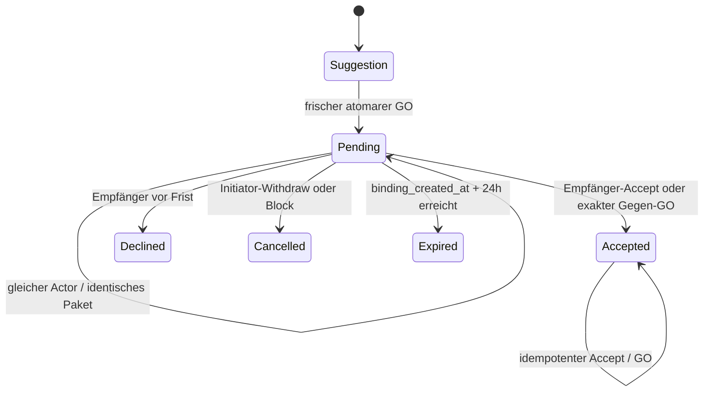

# SmartDeal Core Gate Audit

## 1. Executive Summary

Stand: 2026-09-12. **Core Gate: YELLOW. Design-Gate: YELLOW.** Die internen Domainpfade T1–T6b bilden Berechnung, exakte Paketbindung, Freigabe und Annahme konsistent ab. Für den zusammenhängenden App-Core fehlt jedoch der abgesicherte Übergang zu bestehenden Request-/Lifecycle-Handlern. Zwei konkrete Integrationslücken verhindern eine uneingeschränkte Aussage zur Closed-Beta-Tauglichkeit: Legacy-Handler können V1-Zeilen am V1-Service vorbei verändern; der explizite Expiry-Sweep hat noch keinen laufenden App-/Maintenance-Aufrufer.

Die gesperrte Full-Release-Baseline bleibt **1222/1222 GREEN**. Das ist der vorhandene T6b-Nachweis, kein neuer Testlauf dieses Audits. Die dortigen 63 T6b-Tests und 704 Schutztests belegen interne Servicepfade; sie belegen keine vollständige öffentliche V1-Integration. Dieses Audit ist statisch: Quellen, Implementierungen, Testkörper und vorhandene Messberichte wurden geprüft. Keine Tests oder Benchmarks ausgeführt, keine DB geöffnet oder migriert, keine Implementierung geändert.

Grundlagen sind [Product Bible](SMARTDEAL_PRODUCT_BIBLE_V1.md), [historischer IST-Audit](SMARTDEAL_V1_IST_AUDIT.md), [Algorithm Contract](SMARTDEAL_ALGORITHM_CONTRACT_V1.md), [Roadmap](SMARTDEAL_TECHNICAL_ROADMAP_V1.md) und die Berichte [T3a](SMARTDEAL_T3A_OPTIMIZATION_PROOF.md), [T3b](SMARTDEAL_T3B_OPTIMIZER_REPORT.md), [3b.1](SMARTDEAL_T3B1_PERFORMANCE_INVESTIGATION.md), [T6a](SMARTDEAL_T6A_OPPORTUNITY_IDENTITY.md), [T4](SMARTDEAL_T4_SUGGESTION_REVALIDATION.md), [T5a](SMARTDEAL_T5A_ATOMIC_BINDING.md), [T5b](SMARTDEAL_T5B_RELEASE_EXPIRY.md), [T6b](SMARTDEAL_T6B_ACCEPT_MUTUAL_GO.md). Historische offene Produktfragen und das frühere T3b-YELLOW werden durch die später geschlossenen Verträge beziehungsweise 3b.1 ersetzt; sie werden hier nicht wieder geöffnet.

**26 Invarianten geprüft; 0 RED, 2 ORANGE, 2 YELLOW Findings.** Kein fundamentaler neuer Algorithmus- oder Produktentscheid erforderlich. YELLOW beim Design-Gate bezeichnet den noch fehlenden Anschlussnachweis aus Roadmap §Design-Gate, keine Forderung nach vollständiger Versand-/Kontaktimplementierung vor Design.

## 2. End-to-End Core Trace

Statisches, repräsentatives Beispiel, kein neu ausgeführter 17er-Test: A und B sind berechtigt und in zwei gemeinsamen Album-Pools aktiv. A gibt 17 unterschiedliche Positionen (9 in Album X, 8 in Y), B andere 17 Positionen derselben beiden Alben. Jeder Geber besitzt je Position zwei Exemplare, davon eines geschützt; der Empfänger besitzt null. Es gibt keine anderen Bindungen. Die folgenden Mengen beziehen sich auf diese 34 Positionen.

| Schritt / Service | Input → Output | Persistenz | Supply / Need / Inventory | Weiter |
| --- | --- | --- | --- | --- |
| `SmartDealPlanningService.build_pairwise_inputs(A)` | Actor, Katalog, aktuelle Bestände/Bindungen/Eligibility → konsistenter eigener PlanningState und Partnerdaten | Nein; eigener Read-Snapshot, vorhandene Caller-TX bleibt erhalten | Je Geber 17 freie Kopien; je Empfänger 17 binäre freie Needs; physisch unverändert | Pairwise |
| `SmartDealPairwiseService.from_planning_inputs` | Derselbe Snapshot → vollständige Kandidaten beider Richtungen, paarweise maximal 17 | Nein, null SQL | Noch keine globale Zuteilung, keine Bindung | Optimizer |
| `SmartDealOptimizer.optimize` | Vollständige Opportunities + derselbe State → hier ein 17↔17-Deal | Nein, null SQL | Exakte globale konfliktfreie Auswahl, keine Reservation | Identity |
| `SmartDealIdentityService.from_deal` / `from_view` | Teilnehmer und konkrete Leistungen → kanonische volle Identity + SHA-256 | Nein, null SQL | A- und B-Spiegelansicht identisch; keine Mengenänderung | Suggestion |
| `SmartDealSuggestion.from_deal` | Deal → immutable Payload mit vollständiger Identity, Richtungen, Menge und Alben | Nein | Keine Bindung; Rank ist keine Vertragsleistung | Revalidation |
| `SmartDealSuggestionValidator.validate` | Exaktes Paket + vertrauenswürdiger Actor → VALID oder STALE/INVALID | Nein | Frische Prüfung beider Supply-/Need-Seiten und Eligibility; VALID hält nichts fest | Atomarer GO |
| `SmartDealAcceptanceService.go` → T5a `_create_locked`; alternativ T5a `create_from_suggestion` für Erstbindung | Payload → BEGIN IMMEDIATE, frische T4-Prüfung, Quota und gespeicherte Reservationsdeckung, CREATED mit Request-/Trade-ID | Ja, eine TX | 1 V1-Request `open`, 1 Trade `open`, 34 Positionen, 34 aktive Reservationen. Je Seite 17 Supply und 17 Incoming Needs gebunden. Physisch weiterhin zwei/ null | Pending |
| Pending / erneute Projektion | Dieselbe DB → gebundene Supply/Needs fehlen im freien Plan | Keine zusätzliche Mutation | `binding_created_at` einmal gesetzt; `accepted_at=NULL`; Legacy-Codelisten leer, Leistungen ausschließlich positionsbasiert | Freigabe oder Annahme |
| `SmartDealReleaseService.decline/withdraw/expire` | Berechtigter Actor bzw. fällige Frist → terminale Instanz | Ja, Status/Lifecycle/Reservationsfreigabe atomar | Alle 34 Reservationen freigegeben; 34 Incoming-Zusagen entfallen, sofern kein anderer Vertrag sie bindet. Inventory unverändert | Neue Berechnung, ggf. neue Request-Instanz |
| `SmartDealAcceptanceService.accept` oder Gegen-GO | Empfänger akzeptiert bzw. B bestätigt exakt dieselbe Identity → ACCEPTED derselben Request-/Trade-ID | Ja, Status, `accepted_at`, Lifecycle und genau ein Acceptance-Event | Alle 34 Reservationen bleiben; beide Need-Seiten bleiben gebunden; Inventory unverändert | T7a-Lifecycle, noch kein Versand |

Release und Accept sind alternative Enden derselben Pending-Instanz. Nach Release darf dasselbe konkrete Paket später eine neue Instanz erzeugen; Identity ist Paketidentität, keine ewige Einmaligkeitsregel. T5a allein akzeptiert den Gegen-GO ausdrücklich nicht: Die Orchestrierung für Mutual GO liegt in T6b. Eine freie T4-Revalidation eines bereits gebundenen Pakets ist erwartbar STALE; T6b prüft deshalb dessen eigene exakte Bindung plus aktuelle Ausführbarkeit und fremde Zusagen.

Reale vorhandene Integrationsbelege: T4 `SuggestionTests.plan` nutzt T2a→T2b→T3b; T5b `cycle` prüft echte Anlage, Freigabe, erneute Projektion und Wiederanlage; T6b `test_multi_album_mutual_go`, `test_mirrored_go`, `test_accepted_pipeline_remains_bound_after_24h` verwenden diese Grundlage. Sie sind mehr als isolierte DTO-Tests. Der zusätzliche kombinierte Gap steht in §12.

## 3. Canonical State Machine



Die drei terminalen Pending-Abgänge sind Alternativen, keine Kette Declined→Cancelled→Expired. Suggestion ist ein reines Objekt ohne DB-Status. Pending bedeutet `trade_requests.status='open'`, V1-Klassifikation, vollständige aktive Positionen/Reservationen, gesetztes `binding_created_at`, kein `accepted_at` und noch nicht erreichte Frist. Zeitlich abgelaufen und bereits persistiert `expired` sind bis zur expliziten Freigabe unterschiedliche technische Sachverhalte.

| Übergang | Actor / Guards | DB-Status und Bindung | Inventory / Notification |
| --- | --- | --- | --- |
| Suggestion→Pending | Beteiligter; kanonischer Payload; frische Eligibility, Supply, Need; max. drei eigene aktive V1-Anfragen; Schreiblock | Request/Trade `open`, beidseitig vollständig gebunden | Keine physische Buchung; keine neue Notification |
| Pending→Pending | Derselbe Initiator, gleiche vollständige Identity, intakte Bindung | Keine zweite Instanz, kein Zeitreset | Keine Buchung/Notification |
| Pending→Accepted | Nur Empfänger für explizites Accept; Gegen-GO entsprechend; vor Frist, vollständig eigene Bindung, aktuelle Ausführbarkeit, keine fremden Need-Konflikte | Request/Trade `accepted`; `accepted_at` einmal; Bindungen bleiben | Keine Buchung; ein bestehendes Event `smart_request_accepted`, keine neue Typed-Accept-Notification |
| Accepted→Accepted | Berechtigter Retry; akzeptierte Fakten/Positionen/Reservationszustand werden geprüft | Zeit und Instanz unverändert; Core-Prüfung gilt vor weiterem Shipping-Lifecycle | Kein zweites Event, keine Buchung |
| Pending→Declined | Empfänger; V1, vollständig unversandt, nicht akzeptiert, noch vor Frist | Request/Trade `declined`; alle eigenen aktiven Reservationen frei | Keine Buchung; bestehende Decline-Notification genau einmal in derselben TX |
| Pending→Cancelled | Initiator-Withdraw; außerdem integrierter Community-Blockpfad | Request/Trade `cancelled`; Gründe `withdrawn` oder `blocked`; vollständige Freigabe | Keine Buchung; Release erzeugt keine neue Withdraw-/Block-Notification |
| Pending→Expired | Interner `expire/sweep` oder verspäteter berechtigter GO/Accept/Release; `now >= binding_created_at+24h` | Request/Trade `expired`; vollständige Freigabe | Keine Buchung; keine Decline-Notification bei verspäteter Ablehnung |
| Terminal→Terminal | Wiederholung nur bei nachweislich vollständig freigegebener Instanz | NOOP; ursprünglicher terminaler Fakt bleibt | Keine doppelte Wirkung |

`INVALID`, `STALE`, `BUSY`, `NOT_PENDING`, `ALREADY_CREATED`, `ALREADY_ACCEPTED` und vergleichbare Result-Codes sind Serviceergebnisse, keine zusätzlichen Requestzustände. Korruption/inkomplette Bindungen führen zu Fehler und Rollback, nicht zu einem erfundenen DB-Status. Ein eigener V1-Unfulfillable-Übergang bei Bestandskorrektur ist bis T6b **nicht implementiert**; STALE beendet nicht automatisch einen accepted Vertrag. Das gehört zu T7b gemäß AC26. Bestehende Legacy-Problem-/Failed-Zustände sind keine bereits abgenommene V1-Implementierung.

## 4. Invariant Matrix

Referenzen in dieser Matrix: `P` = [smartdeal_planning.py](../App/services/smartdeal_planning.py), `O` = [smartdeal_optimizer.py](../App/services/smartdeal_optimizer.py), `S` = [smartdeal_suggestions.py](../App/services/smartdeal_suggestions.py), `Q` = [smartdeal_requests.py](../App/services/smartdeal_requests.py), `R` = [smartdeal_release.py](../App/services/smartdeal_release.py), `A` = [smartdeal_acceptance.py](../App/services/smartdeal_acceptance.py). Testkürzel verweisen auf `tests/test_sd_t1_contract_foundation.py`, `test_sd_t2a_planning_state.py`, `test_sd_t2b_pairwise.py`, `test_sd_t3a_optimization.py`, `test_sd_t3b_optimizer.py`, `test_sd_t4_suggestions.py`, `test_sd_t5a_atomic_binding.py`, `test_sd_t5b_release_expiry.py`, `test_sd_t6b_accept_mutual_go.py` entsprechend T1…T6b. Genannte Methoden sind die konkreten Testbelege, keine neu ausgeführten Tests.

| # | Invariante / Urteil | Codebeweis | Testbeweis |
| --- | --- | --- | --- |
| 1 | 1:1: GREEN im Topplan und V1-Payload | O `_validated_plan`, S `_payload_identity`, Q `identity_for_request` | T4 `test_y_unbalanced_even_with_recomputed_identity`; T3b Differentialtest |
| 2 | Max. 5 TopDeals: GREEN, nicht max. 5 Pairwise-Chancen | O `_validated_plan`, `_smartdeal_flow.py` vollständige Teilmengen bis fünf | T3a `test_h_more_than_five_global_selection`, von T3b gegen Runtime wiederholt |
| 3 | Min. 5↔5: GREEN im Topplan/GO | O `_validated_plan`, S `_payload_identity` | T3a `test_i_four_not_top`, `test_j_five_is_top`; T4 `test_bad_metadata_and_minimum_are_invalid` |
| 4 | Partner max. einmal: GREEN | O Input-Mapping/Teilmenge und `_validated_plan` | T3a `test_h_more_than_five_global_selection`, `test_invalid_plans_rejected`; T3b 500 vollständige Oracle-Vergleiche |
| 5 | Outgoing nicht doppelt: GREEN im Plan und V1-Writer | O Supply-Counter; Q frische Prüfung unter BEGIN IMMEDIATE + gespeicherte Deckung | T3a `test_c_shared_outgoing`; T5a `test_y_competing_outgoing_copy_only_one_wins` |
| 6 | Incoming nicht doppelt: GREEN in V1-Plan/Bindung | O Incoming-Counter ≤1; P zugesagte Needs; A `_currently_executable` ohne eigene, mit fremden Zusagen | T3a `test_d_shared_incoming`; T5a `test_z_competing_incoming_need_with_spare_giver_copies`; T6b `test_foreign_promised_need_stays_protected` |
| 7 | Protected copy nie Supply: GREEN | P `_pieces`/Availability; S aktuelle freie Supply | T2a `test_last_copy_never_supply`; T4 `test_l_last_copy_is_not_free_supply` |
| 8 | Reservierte Menge nicht angeboten: GREEN für wirksame Bindung; Expiry-Abweichung §7 | P `_project_bindings`, `_pieces`; Q zusätzlicher gespeicherter Reservationsguard | T2a `test_two_reservations_leave_two_of_five`; T5a `test_new_package_cannot_overdraw_unreleased_expired_supply` |
| 9 | Gebundener Need nicht erneut angeboten: GREEN im kanonischen V1-Plan | P `_pieces`, `_project_bindings`; Pairwise nutzt freie Needs | T2a `test_accepted_incoming_is_not_free_need`; T2b `test_partner_committed_need_is_respected` |
| 10 | Vorschlag reserviert nichts: GREEN | S `from_deal`, `validate`; P reine Projektion | T4 `test_valid_is_not_reserved_next_read_can_be_stale`, `test_no_mutation_or_caller_transaction_commit` |
| 11 | GO revalidiert frisch: GREEN | Q `_create_locked` ruft T4 nach Schreiblock; A Accept prüft aktuelle eigene gebundene Ausführbarkeit | T5a `test_revalidation_occurs_after_write_lock_and_same_clock`, `test_l_previous_valid_is_not_write_authorization` |
| 12 | Anlage atomar: GREEN | Q öffentlicher TX-Wrapper; A `_transaction` + geteiltes `_create_locked` ohne Zwischencommit | T5a Rollbacktests `test_s_failure_after_request_insert`, `test_u_failure_b_reservation`, `test_commit_failure_rolls_back_all` |
| 13 | Beide Seiten gebunden: GREEN | Q Bulk-Positionen/Reservationen, `_assert_complete` | T5a `test_c_d_e_f_g_h_both_bindings_one_time_no_inventory_or_acceptance` |
| 14 | Need + Supply gemeinsam: GREEN, Need ist Projektion derselben Fakten | Q `_assert_projected` innerhalb derselben TX | T5a `test_i_j_fresh_pipeline_cannot_reuse_bound_resources`, `test_failure_during_real_t2a_postwrite_need_projection` |
| 15 | Pending max. 24h: GREEN für Annahmegültigkeit; ORANGE für automatisch persistierte Freigabe | `smartdeal_expiry.expires_at`; A `_accept_locked`, R `sweep`; kein Sweep-Aufrufer (§11 O2) | T5b `test_before_deadline_still_active`, `test_exact_deadline_expired`, `test_after_deadline_expired`, `test_reloaded_binding_controls_all_readers_and_retry`; T6b Fristraces |
| 16 | Withdraw/Decline/Expiry vollständig frei: GREEN über R; ORANGE beim alten HTTP-Decline | R `_release_locked`, `_verify_released`; Gegenbeleg `webapp.decline_trade_request` | T5b `test_decline_full_cycle`, `test_withdraw_full_cycle`, `test_expiry_full_cycle`, `test_multi_album_release`; kein V1-HTTP-Decline-Beleg |
| 17 | Accepted bleibt gebunden: GREEN im Core; ORANGE am Legacy-Confirm | A `_accept_locked`, `_verify_accepted`; R Accepted-Guard | T6b `test_accepted_pipeline_remains_bound_after_24h`; T5b `test_accepted_not_released_by_any_pending_command`; Gegenpfad §6 |
| 18 | Mutual GO ohne zweiten Request: GREEN | A `_lookup` voller Paketvergleich, `_accept_locked` gleiche ID | T6b `test_mutual_go_existing_request`, `test_race_four_go_intentions_one_instance` |
| 19 | A/A bleibt pending: GREEN | A `go` erkennt Initiator, prüft bestehende Bindung | T6b `test_idempotent_initiator_go_stays_pending`, `test_idempotent_parallel_same_actor` |
| 20 | A/B akzeptiert: GREEN | A `go` leitet Gegen-GO an `_accept_locked` | T6b `test_mirrored_go`, `test_race_a_go_b_go`, `test_race_b_go_a_go` |
| 21 | accepted_at stabil: GREEN | A bedingtes Update + Retry-Verifikation; Migration 0021 Write-once-Trigger | T1 `test_time_storage_is_distinct_persistent_and_write_once`; T6b `test_idempotent_accept` |
| 22 | binding_created_at stabil: GREEN | Q einmalige Anlage; A/R erhalten Zeit; Migration 0021 | T5a `test_k_same_actor_retry_preserves_identity_and_timestamp`; T5b `test_reloaded_binding_controls_all_readers_and_retry` |
| 23 | Physisches Inventory bis Lifecycle unverändert: GREEN im Core | Q/R/A schreiben keine Bestandsmengen; spätere Adapter noch offen | T5a gemeinsamer Bindungstest; T5b `cycle`; T6b `test_explicit_accept_and_exact_mutation_set` |
| 24 | Legacy bleibt Legacy: GREEN V1→Legacy; ORANGE Gegenrichtung | `trade_contracts.request_contract_type`, Q/R/A V1-Guards; fehlender HTTP-Dispatch §6 | T1 `test_historical_smart_marker_does_not_become_v1`, `test_legacy_smart_expiry_remains_48_hours_on_v21`; T6b `test_legacy_rejected`; T5b `test_legacy_never_released` |
| 25 | Privacy/Blocks: GREEN in Domainprojektion und Mutation; Kontakt separat T8a | P Eligibility/Community, S aktuell, A `_currently_executable`, Community Block-TX | T2a `test_blocks_both_directions_remove_partner`, `test_private_with_explicit_pool_preserves_existing_trade_contract`; T4 `test_q_blocks_both_directions`; T5b `test_block_releases_v1_and_keeps_legacy_behavior`; T6b `test_block_is_stale_without_bypassing_eligibility` |
| 26 | Keine Clientdaten als Bestands-/Berechtigungswahrheit: GREEN intern | S `_payload_identity` prüft vollständiges Paket; Q/A lesen aktuelle DB unter Lock, Actor muss serverseitig authentifiziert sein | T4 `test_v_manipulated_participant_or_actor`, `test_full_identity_checked_even_under_digest_collision`; T6b `test_invalid_payload_no_writes`, `test_third_and_noncanonical_actor_rejected` |

Ein selbst berechenbarer SHA-256 ist keine Signatur und kein Nachweis, dass ein Paket früher auf Rang 1 stand. Das ist auch nicht der Vertrag: Der konkrete Payload ist eine beantragte Leistung, deren kanonische Struktur und aktuelle Ausführbarkeit der Server unabhängig überprüft. Die spätere HTTP-Schicht muss den Actor aus der Session liefern. Daraus folgt keine heute bereits vorhandene V1-Route.

## 5. Race / Atomicity Review

Q, R und A erwerben für öffentliche Mutationen denselben SQLite-Schreiblock mit `BEGIN IMMEDIATE`. Zeit und Zustand werden danach gelesen. T6b komponiert private T5a-/T5b-Operationen innerhalb seiner eigenen TX; diese führen keinen Zwischencommit durch. Community-Block verwendet den gesperrten Release-Baustein in seiner bestehenden TX. Fehlende Locks/nested Caller-TX werden nicht still übernommen. BUSY und injizierte Fehler lassen keine Teilbindung zurück.

| Kombination | Zusammengesetzter Nachweis / Ergebnis |
| --- | --- |
| Zwei GO derselben Opportunity, A/A | T5a `test_x_identical_concurrent_creation_once`; T6b paralleler gleicher Actor: eine vollständige Pending-Instanz, stabile Zeit |
| A/B, B/A, vier gleichzeitige Absichten | T6b `test_race_a_go_b_go`, `test_race_b_go_a_go`, `test_race_four_go_intentions_one_instance`: einmal Create, einmal Accept, gleiche Instanz |
| Unterschiedliche konkurrierende Opportunities | T5a outgoing/Need-Races; T6b `test_race_other_opportunity_never_bypasses_binding`: zweite Operation sieht Bindung, keine Paketverschmelzung |
| Accept vs Decline / Withdraw | T6b testet beide Reihenfolgen je Paar: zuerst Accept schützt Bindung, zuerst Release verhindert spätere Annahme |
| Accept vs Expiry | T6b drei Fristraces: vor Frist angenommener Fakt bleibt; exakt fälliges Accept führt zur T5b-Freigabe, unabhängig von Reihenfolge |
| Release vs neue Bindung | T5b `test_race_release_then_new_binding`, `test_race_create_first_sees_existing_binding`: neuer Writer sieht entweder noch gültige Bindung oder vollständige Freigabe |
| Letzte freie Kopie, auch Legacy/V1 | T5a beide Legacy-Accept/V1-GO-Reihenfolgen und knappe outgoing-Kopie: gemeinsame physische Reservationsdeckung schützt |
| TX-Fehler über mehrere Services | Q Postwrite-P-Projektion, R zweite Seite/Notification/Commit, A Event/Projektion/Commit: vollständiger Rollback laut jeweiligen Tests |

Diese Aussage gilt für die geprüften Einstiegspunkte. Der alte HTTP-Decline umgeht R; der alte Confirm umgeht den künftigen V1-Lifecycleadapter. Ein SQLite-Lock allein repariert deren falschen Mutationsumfang nicht. Das ist ein tatsächlicher kombinierter Gap (§6), kein Widerspruch zur Korrektheit der getesteten R/A-Races. Reverse Legacy-Accept bei noch freier zusätzlicher Kopie ist zudem kein Beweis für globale binäre Need-Eindeutigkeit aller manuellen Verträge; Legacy hat seinen eigenen Mengenvertrag.

## 6. Legacy Boundary Review

| Tatsächliche Grenze / Adapter | Befund |
| --- | --- |
| Migration 0021 + `trade_contracts.request_contract_type` | Explizit V1 oder Legacy; Altspalte fehlt → Legacy-Fallback; explizit unbekannt/NULL wird nicht geraten. Bestehende Klassifikation unveränderlich. Alte SmartMatch-Markierung macht keinen V1-Vertrag. |
| P `_binding_rows` / `_project_bindings` | Gemeinsamer Positions-/Reservationsreader, klassifizierte Projektion: Legacy offene SmartMatch-Anfrage bleibt ungebunden/48h; alte accepted Reservationen bleiben wirksam. V1 Pending berücksichtigt absolute 24h. |
| Q Persistenz / `identity_for_request` | `trade_requests.album_id` nur technischer Kontext des ersten kanonischen Albums; `give_codes/get_codes=[]`. Vollständige Wahrheit liegt in Multi-Album-Positionen. Rekonstruktion statt Vertrauen in alten JSON-Adapter. |
| `TradeReservationService.accept`, alter HTTP-Accept | Alter Service verwendet Legacy-Codelisten; leerer V1-Adapter verhindert normale V1-Neuannahme (T5a-Test). Keine ausdrückliche V1-Dispatch-Grenze; bereits `accepted` wird im alten Service früh als bestehender Fakt behandelt. Der HTTP-Fallback ohne Reservationsschema schreibt alten Accepted-Status direkt; kein legitimer vollständiger V21-Betrieb, aber keine V1-Sicherheitsgrenze. |
| `SmartTradeRequestService` / `is_smart_trade_request` | Alter Marker und alter 48h-Vertrag; reguläre V1-Flags 0 sind nicht SmartMatch-Marker. Kein Ersatz für explizite Contract-Prüfung in generischen Handlern. |
| `webapp.decline_trade_request` (Zeile 11091) | Prüft Empfänger/open, aktualisiert auf `declined`, erzeugt Notification und commit. **Keine Contract-Verzweigung, keine Reservationsfreigabe.** Ein vorhandener Pending-V1-Request kann so terminal mit aktiven Reservationen verbleiben. |
| `webapp.confirm_trade_done` (Zeile 11529), `complete_trade_if_ready` (8079), `complete_trade` | Guard gegen alten Confirm ist vorhandene Shipping-Statuszeile, nicht `contract_type`. T6b-Accept legt keine solche Zeile an. Beide Teilnehmer können Confirm setzen; danach generische Freigabe und `completed`. Der alte Buchungsadapter liest leere V1-Codelisten: keine positionsbasierte Versand-/Empfangsbuchung. Somit vorzeitig abgeschlossener V1-Vertrag ohne Versand möglich, sobald V1-Zeilen diesen Handlern zugänglich sind. Statischer Kontrollflussbefund, kein ausgeführter HTTP-Test. |
| `webapp.fail_trade_done` | Ebenfalls generischer accepted-Handler ohne V1-Dispatch; bestehende Fail-/Release-Regel ist noch kein abgenommener T7a/b-Vertrag. |
| `TradeReservationService.release` | Generischer Baustein mit Bulk-Freigabe; unter R inklusive V1-Prüfungen korrekt wiederverwendet, allein kein V1-Autorisierungs-/Atomaritätsvertrag. |
| `CommunityService.block` | Bereits expliziter V21-Adapter: offene nicht akzeptierte V1-Verträge vollständig über R im Block-TX freigeben; verbleibender Legacy-Updatepfad getrennt. V20-Fallback bleibt alt. Accepted wird nicht durch Pending-Release beendet. |
| `TradeShippingService.ship`, `TradeReceiptService.receive`, Problem-/Completion-Services | Positionsbasierte Grundlage vorhanden, aber keine geschlossene V1-Adapterabnahme. T6b `_verify_accepted` verlangt noch unversandten Materialisierungszustand; ein späterer generischer Ship macht den ursprünglichen Core-Retryvertrag nicht automatisch lifecyclefähig. T7a muss Zuständigkeit und Retry nach Versand definieren. |
| History / Erfolg / Ratings / Notifications | Bestehende positionsbasierte Projektionen und deduplizierte Ereignisse wiederverwendbar. Accepted allein ist kein erfolgreicher Abschluss. Single-Album-Callbacks und alter Confirm sind verbleibende Übergangsstellen; T6b schreibt nur ein Acceptance-Event. Bestehende sichere Notification-Zielauflösung ersetzt keine V1-sichere Mutation am Ziel. |

Neuer Code klassifiziert Legacy explizit und ändert dessen Vertrag nicht. Die Gegenrichtung ist **nicht durchgängig geschlossen**. Die Risiken entstehen bei Erreichbarkeit von intern erzeugten V1-Zeilen über bestehende Handler; dieses Audit behauptet keine bereits aktivierte öffentliche SmartDeal-V1-Erzeugung. Die gemeinsame Supply-Deckung ist getestet. Eine universelle DB-Unique-Regel für Incoming Needs über beliebige manuelle Legacy-Verträge existiert daraus nicht; die binäre Need-Regel gehört zum V1-Plan und dessen Mutationen.

## 7. Inventory / Reservation / Need Consistency

| Zustand | Physisch | Freie Supply | Incoming Need |
| --- | --- | --- | --- |
| Vorschlag | Unverändert | Physisch minus geschütztem Exemplar und wirksamen Reservationen | Fehlend minus wirksam zugesagte Eingänge |
| Pending vor Frist | Unverändert | Beide ausgehenden Seiten gebunden | Beide eingehenden Seiten zugesagt, nicht frei |
| Accepted vor Versand | Unverändert | Bindung bleibt unabhängig vom Alter | Zusage bleibt auch nach 24h |
| Vollständig über R freigegeben | Unverändert | Eigene Reservationen released; andere bleiben | Eigene Zusage entfällt; tatsächlich vorhandene oder anderweitig gebundene Stücke werden nicht neu fehlend |
| Zeitlich expired, noch nicht gesweept | Unverändert | P behandelt V1 zeitlich unwirksam; allgemeiner InventoryRead sieht gespeicherte aktive Reservationen weiter | P betrachtet den alten Need als frei |
| Durch alten HTTP-Decline terminal, Reservationen noch aktiv | Unverändert | Dieselbe Projektionsdifferenz, ohne regulären Sweep-Reparaturpfad | P löst terminale V1-Zusage logisch auf |
| Nach Versand/Empfang | Erst Lifecycle bucht aus/ein | Transit ist kein frei verfügbares Eigentum | Versandte Zusage bleibt bis realem Empfang/Problementscheidung; V1-Anschluss T7a offen |

Im internen Core gibt es keine Mengenbuchung, die physisches Inventory negativ machen könnte. Availability begrenzt Unterdeckung auf keine freie Supply; Writer und Accept prüfen aktuelle Deckung. Zwei V1-Verträge dürfen dieselbe freie Kopie/Need nicht erhalten. Das ist durch Lock, aktuelle Projektion und Konkurrenztests belegt, keine allgemeine Garantie gegen beliebige fremde SQL-Schreiber.

**Ein expired Deal kann aktuell weiterhin blockieren:** P gibt ihn zeitlich frei, Q prüft zusätzlich die noch gespeicherten aktiven Reservationen und verweigert eine Überzeichnung. Das schützt Inventory, lässt aber Vorschlag und tatsächliche Neubindbarkeit auseinanderfallen. `sweep` behebt reguläre fällige offene V1-Zeilen erst bei explizitem Aufruf. Der alte HTTP-Decline ist noch ungünstiger: Status bereits terminal, daher nicht im offenen Sweep; R erkennt unvollständige Freigabe als Inkonsistenz statt erfolgreichen Retry. Accepted-Ressourcen bleiben über Core-Release geschützt, können über alten Confirm dennoch vorzeitig freigegeben werden. Diese zwei Gegenbeispiele sind O1/O2, nicht zusätzliche Findings.

## 8. Performance Summary

Nur vorhandene lokale Messungen, keine neuen Benchmarks oder SLA. Werte in Millisekunden; verschiedene Harnesses/Umfänge sind nicht additiv als End-to-End-Messung zu verstehen.

| Stufe | Vorhandener Nachweis | Einordnung |
| --- | --- | --- |
| PlanningState | Einzelstate 17 SQL; vollständiger Batch 21 einschließlich eigener BEGIN/ROLLBACK, unabhängig von Partneranzahl im Querycount-Test | Keine separate aktuelle Laufzeitmessung ableitbar; DB-/Datenmenge bleibt relevant |
| Pairwise | Reine Berechnung null SQL; mit frischem Planning-Batch 21 SQL | Nicht global optimierend; keine gesonderte belastbare Millisekundenzahl |
| Optimizer nach 3b.1 | A 0,153–0,238; B 1,428–2,063; C ca. 86–87,482; D ca. 47,9–50,1; gemischter E 85,8–87,296; dichter F 452,1–454,732; einzelner 150er G 1,016–1,040 | Teuerster CPU-Schritt. Früherer E mit ca. 2,16s durch akzeptierten exakten Fix ersetzt. Keine Heuristik/Abbruchantwort |
| Identity | 5er ca. 0,006; 28er 0,021; 150er 0,095 | Trivial relativ zur Suche, null SQL |
| T4 Revalidation | 5er 0,107–0,111; 25er ca. 0,230; 150er ca. 0,97; 21 SQL | Enthält frische Planning-Lesekosten; kein Optimizer |
| T5a atomarer GO | Serienmittel 5er 0,849–0,892; 25er über zwei Alben 1,583–1,611; 150er 6,156–6,797; Trace 59/62/62 | Vollständiger Writepfad einschließlich Revalidation, Setup außerhalb |
| T6b Accept / Mutual GO | Accept 5er Mittel 1,264–1,287; Mutual 5er 1,242–1,249; 25er 2,954–3,508; 150er 13,811–14,441 (Maximum 19,441) | Vollständige TX; Trace 95/97/121/121 inklusive Trigger. Keine SQL-Schleife je Sticker |
| T6b Lookup | Sechs aktive Anfragen, drei pro Seite: Mittel 0,111–0,131; zwei SELECT plus BEGIN/COMMIT | Volle Identity, kein Hash-only-Match |
| T5b Release / Sweep | Release 5er Mittel 0,532–0,555; 25er 1,022–1,093; 150er 3,836–4,068. Sweep 30 Requests 5,780–5,819 | Explizite Ausführung; kein Beleg für laufende Scheduling-Integration |

Ein künftiger Discovery-Request liest einen Snapshot und berechnet den globalen Plan; die CPU-Suche dominiert größere überlappende Fälle. GO/Accept lösen keine globale Suche innerhalb des Schreiblocks aus. Das reduziert Lock-Arbeit, beseitigt aber nicht SQLite-Schreiberkonkurrenz. Revalidation ist bereits in GO enthalten; Planung nochmals auf GO-Zeit zu addieren würde doppelt zählen.

Für die gemessenen internen Fälle wirkt der Core grundsätzlich für weitere Beta-Integration brauchbar. Es fehlt ein integrierter HTTP-/Mehrnutzer-Lastnachweis; für große 50-/99-Partner-Konfliktmengen ist keine allgemeine Latenzgrenze belegt. Der exakte Solver prüft potenziell Teilmengen bis Größe fünf. Alte R4-Routenwerte gelten nicht automatisch für diesen neuen Weg. Performance begründet hier keinen neuen RED-Blocker, aber Y2 vor Beta-Abnahme.

## 9. Remaining Technical Blocks

| Block / Kategorie | Vor PO-SOLL technisch eindeutig erforderlich | Darf Implementierung nach Design-Gate folgen? |
| --- | --- | --- |
| Core-Anschluss O1/O2 | Zuständiger V1-Dispatch, kein Legacy-Confirm-Bypass; eindeutiger Expiry-Aufruf/Read-Vertrag und Adapteranschlussnachweis | Ja, öffentliche Nutzung erst nach Umsetzung/Nachweis; derzeitiger uneingeschränkter Gate-Nachweis fehlt |
| T7a Lifecycle, History, Notifications | Übergabe accepted Positionen; Ship/Receipt jeweils genau einmal; Grenzen alter Confirm-/Fail-Handler; Status-/Retry- und Event-Vertrag | Ja. Vollständige Lifecycleimplementierung muss vor T10/Beta vorliegen |
| T7b Bestandskorrektur / Unfulfillable | AC26 steht fest: accepted vor open, ältere Bindung vor jüngerer, ID-Tie-Break; vor Versand vollständiges Ende, nach Versand Problemweg. Technische Zustands-/Action-required-Abbildung muss zum SOLL passen | Ja. Kein neuer Prioritätsentscheid nötig; Nachweis vor UI-Integration |
| T8a Versandkontakt | Berechtigte bestätigte Partner, ausdrückliche konkrete Freigabe; gespeicherte Adresse ist keine Freigabe; technischer Änderungs-/Widerrufs-/Problemzugriff und Datenlebenszyklus konkretisieren | Ja. Sicherer Kontakt ist Beta-Pflicht, keine Voraussetzung für fertige Persistenz vor Design |
| T8b Chat | Optional, separat zu wählen; kein Ersatz für Kontakt | Ja, auch später; kein Beta-Gate |
| T9 Route-/IA-Audit + PO-SOLL | Bestehende Detail-/Aktions-/Rückwege und neue Zustände vollständig erfassen, auf klare Core-/Lifecycle-/Kontaktverträge stützen | T9 ist der nächste eigene Analyse-/PO-Block nach Gateklärung, noch keine Route/UI |
| T10 UI-/Design-Integration | PO-SOLL und separate visuelle Entscheidung; T7a/b/T8a technisch umgesetzt | Ja, ausdrücklich erst danach |
| T11 Golden Path / Regression / Performance | Testumfang kann vorher definiert werden | Ja; abschließende integrierte Abnahme zwingend vor Beta |

Nicht alles ist ein fehlendes Core-Feature: T7a/b sind nachgelagerte Lifecyclearbeit, T8a Versandermöglichung, T9 IA/Produktfluss, T10 sichtbare Umsetzung, T8b optional. O1/O2 sind dagegen reale Anschlusslücken des heute zusammengesehenen Systems. Keine dieser Einordnungen beginnt hier einen neuen Roadmap-Block.

## 10. Design-Gate Decision

**YELLOW**

Die Berechnungs-/GO-/Release-/Mutual-GO-Semantik ist entschieden und intern nachgewiesen. Für eine GREEN-Aussage zum gesamten neuen sichtbaren Tradebereich fordert die Roadmap zusätzlich: „Accepted-Positionen passen nach geprüftem Adaptervertrag zum bestehenden physischen Lifecycle.“ Der aktuelle generische Confirm-Pfad liefert einen konkreten Gegenbeleg für eine bereits sichere ungeprüfte Weiterverwendung; ein akzeptierter V1-Anschlussvertrag samt gezieltem Nachweis fehlt.

Deshalb kann jetzt auf gesicherter Grundlage über Suggestion, exaktes Paket, Pending, Rückzug und Mutual GO gearbeitet werden; das **uneingeschränkte** Gate für den vollständigen Tradebereich wird noch nicht bestätigt. Vorher den begrenzten Adaptervertrag einschließlich Dispatch/Retry und die Lifecycle-/Kontakt-Zustände technisch festhalten. Dies verlangt keine vollständige T7a/T7b/T8a-Implementierung und keinen neuen Produktregelentscheid. O1/O2 sind Umsetzungsblocker vor öffentlicher UX-Integration, nicht RED-Forderungen, erst sämtliche Folgetechnik vor jeder Designarbeit zu bauen.

Auch nach GREEN wäre weder eine Beta- noch eine Deploy-Freigabe erteilt.

## 11. Risks / Blockers

**Zählung: 0 RED / 2 ORANGE / 2 YELLOW.** GREEN-Nachweise sind die in §4/§5 belegten Core-Eigenschaften, keine künstlich gezählten Findings.

| ID / Kategorie | Echter Befund | Erforderlicher Abschluss, hier nur dokumentiert |
| --- | --- | --- |
| O1 — ORANGE, vor UX-Implementierung | Legacy→V1-Mutationsgrenze offen: `webapp.py:11091` Decline ohne Freigabe; `11529` Confirm plus `8079` Completion ohne V1-Dispatch. Terminale Restreservation bzw. vorzeitige Accepted-Freigabe ohne Versand möglich. Weitere generische Fail-/Lifecycle-Adapter nicht V1-abgenommen | Expliziten Contract-Dispatch/Adaptervertrag schließen und gemischte V1/Legacy-Handlerprüfungen nachweisen. Vor Design-GREEN die Anschlussfähigkeit klar belegen; vollständige T7a-Umsetzung darf anschließend folgen |
| O2 — ORANGE, vor UX-Implementierung | `SmartDealReleaseService.sweep` existiert, aber kein App-/Maintenance-Aufrufer. Zeitlich abgelaufene Bindung wird logisch unwirksam, gespeicherte Reservation kann neue GO blockieren. T5a-Schutztest belegt bewusst diese konservative Ablehnung | Verantwortlichen expliziten Ablaufmechanismus anschließen und dessen Zusammenspiel mit Read/GO testen. Absolute 24h unverändert; keine Rückkehr zu lokaler Kalenderfrist |
| Y1 — YELLOW, späterer Testblock | Teilweise echte Pipeline-Tests vorhanden, aber kein kombinierter Nachweis einschließlich bestehender Handler und operativem Cleanup | Ergänzenden Integrations-/Golden-Path-Test gemäß §12, spätestens vor öffentlicher Integration/Beta |
| Y2 — YELLOW, späterer Performanceblock | Gute interne Messungen, kein integrierter neuer Nutzerweg unter Konkurrenz und kein allgemeiner großer Partnerpool-Nachweis | T11 realistische End-to-End-/Lastprüfung ohne ungeprüfte Übernahme alter R4-Werte |

Größter verbleibender technischer Blocker ist **O1**, besonders der alte Confirm-/Completion-Pfad. Kein Nachweis eines neuen mathematischen Optimierungsfehlers, einer T6a-Paketkollision oder einer internen A/B-Doppelanlage. Keine Wiederöffnung gesperrter Produktverträge.

## 12. Test Gap

**JA**, ein zusammengesetzter Integrationsnachweis fehlt — trotz vorhandener echter Teil-Golden-Paths. T5b prüft bereits planbasierte Anlage/Freigabe/Wiederanlage; T6b echte Mehralbum-Pakete, Spiegelung, Annahme und fortbestehende Bindung. Nicht korrekt wäre die Behauptung, bisher seien nur isolierte Methoden getestet.

Noch zu dokumentierender, später zu implementierender Testumfang:

1. Zwei berechtigte Nutzer, zwei Alben, ein konkretes 17↔17-Paket: echter Planning→Pairwise→Optimizer→Identity→Suggestion-Pfad aus beiden Sichten. Volle Leistungen/Identity vergleichen, nicht nur Hash oder Score.
2. A-GO, DB schließen/neu öffnen, beide kanonischen Planning- und allgemeinen Inventory-Projektionen prüfen: genau eine Instanz, 34 Positionen/Reservationen, 17 gebundene Incoming Needs je Seite, physisches Inventory unverändert. A-Retry bleibt pending.
3. Getrennte Szenariovarianten Decline, Withdraw und exakt 24h: jeweils den künftig tatsächlich verwendeten App-/Maintenance-Einstieg aufrufen; beide Seiten vollständig frei, keine terminalen aktiven Restreservationen, fremde Bindungen erhalten, Wiederanlage möglich. Vor/exakt/nach Frist unterscheiden.
4. Neue Instanz, B-Spiegel-GO bzw. explizites Accept in getrennten Varianten: gleiche Request-ID, genau ein Acceptance-Event, unveränderte `binding_created_at`, stabile `accepted_at`, unveränderte Positionen/Inventory. Nach 24h weiter gebunden.
5. Bestehende Legacy-Decline-/Confirm-/Fail-Einstiege gegen diese V1-Instanzen: entweder korrekter V1-Adapter oder definierte Ablehnung; niemals halbe Freigabe oder Completion ohne Versand. Parallel Legacy-Vorgang unverändert erfolgreich fortführen.
6. Konkurrenzvarianten Accept/Release, Cleanup/neuer GO sowie knappe Kopie/Need mit zweitem Partner über die realen Einstiegspunkte. Beide Lock-Reihenfolgen, Retry und Rollback prüfen; bestehenden Service-Racetests nicht bloß zusätzliche Namen geben.

Versand/Empfang, Kontaktfreigabe, Bestandsverlust nach AC26 und History-Erfolg ergänzen später T7a/b/T8a/T11. Sie werden nicht als bereits fehlgeschlagene T6b-Tests ausgegeben. Keine dieser Tests wurde in diesem Audit implementiert oder ausgeführt.

## 13. Final Recommendation

Die gesperrten Domainblöcke beibehalten. Als nächstes den begrenzten V1-/Legacy- und accepted-/Lifecycle-Anschlussvertrag mit den Gegenbeispielen O1/O2 reviewbar schließen; darauf T9/PO-SOLL aufbauen. T7a/T7b/T8a müssen **nicht vollständig vor UX-Design fertig** sein, ihre fachlich bereits entschiedenen Zustände und technischen Übergänge/Berechtigungen müssen aber eindeutig und anschlussfähig sein. Umsetzung und Integration dieser Pflichtblöcke, O1/O2-Nachweise und T11 bleiben vor öffentlicher Beta nötig.

Auftragsbezogen ausschließlich diese neue Auditdatei. Der bereits vorher umfangreich dirty/untracked Worktree ist kein Audit-Diff. Vergleich gegen `/private/tmp/core-audit-before.json` dient dem Nachweis, dass Runtime, UI, Routes, Tests, Migrationen, Roadmap und DB gegenüber Auditbeginn unverändert bleiben. Vorhandene Release-Zahlen werden nicht als frisch ausgeführte Tests dargestellt.

Kanonische DB `App/Database/sammlr.db`, SHA-256 vorher/nachher:

```text
265de4e7cd438a8c9f2bb6673c7a020570605eed8c326e98ab4c378d2fa6d522
```

Abschlussprüfung: `git status --short`, `git diff --check`, `git diff --stat` sowie Dateihashvergleich. Da `docs/` bereits untracked ist, zeigt der normale Diff-Stat die neue Auditdatei nicht separat; deshalb zusätzlicher Vorher-/Nachher-Dateivergleich und Whitespace-Prüfung der neuen Datei. Kein git add, Commit, Push oder Deploy. Danach STOP.
