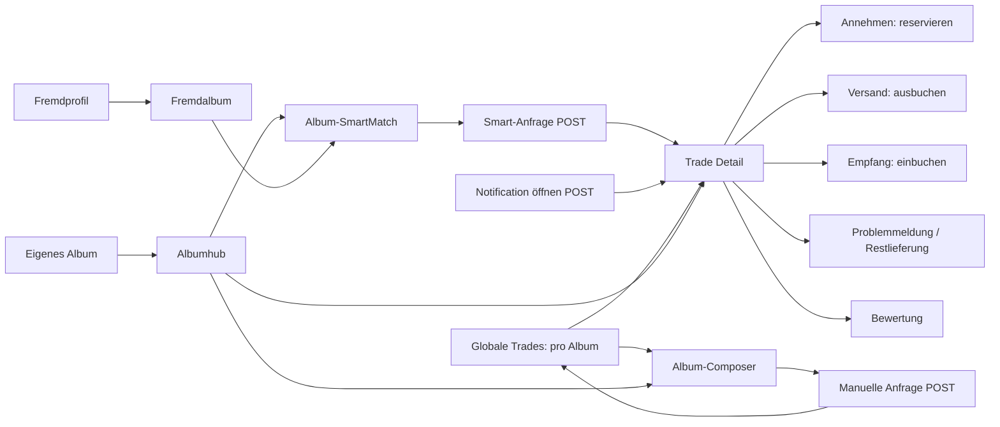

# SmartDeal V1 IST Audit

Stand: 2026-09-09. Grundlage: [SmartDeal Product Bible V1](SMARTDEAL_PRODUCT_BIBLE_V1.md), vollständig gelesen. **Statischer Read-only-Code-/Schema-/Testaudit; keine Ausführung der App, Tests, Migrationen oder Benchmarks, keine Live-DB-Abfragen.** Testaussagen bezeichnen gelesene Assertions, keinen neuen Testlauf. Quellen sind der aktuelle, bereits vorher veränderte Worktree; nicht nur HEAD. Fehlende Fähigkeiten wurden anhand der tatsächlich verdrahteten Pfade, Services, Schema- und Quelltextsuchen beurteilt, nicht anhand von Dateinamen.

Farben bewerten ausschließlich V1-Kompatibilität: GREEN grundsätzlich wiederverwendbar; YELLOW begrenzte Erweiterung; ORANGE deutlicher Vertrags-/IA-Konflikt; RED fehlende oder fundamental unvereinbare Fähigkeit; UNCLEAR nicht zuverlässig nachweisbar. ORANGE ist keine pauschale Bugbewertung. IST, SOLL laut Bible und technische Einschätzung bleiben getrennt. Keine neue Produktentscheidung, kein freigegebener SOLL-Routenbaum.

## 1. Executive Summary

Die mengenbasierte Bestands-, Reservations-, Versand-/Empfangs-, Problem-, Notification-, Privacy- und History-Infrastruktur ist substanziell wiederverwendbar. Insbesondere ist die aktuelle physische Buchung **bereits Bible-kompatibel**: Annahme reserviert ohne Bestandsbuchung; eigener Versand bucht aus; eigener bestätigter Empfang bucht ein. Ein historischer Abschlussadapter existiert daneben und darf nicht mit diesem aktuellen Lifecycle verwechselt werden.

SmartMatch ist weiter als eine isolierte Partnerliste: Es gibt eine deterministische, mengenbegrenzte Konfliktauflösung zwischen bis zu drei Partnerpaketen **innerhalb eines Albums**. Sie ist aber eine gierige Prioritätsallokation, kein global optimaler albumübergreifender Plan. Eine Testbezeichnung mit „joint optimization“ ist kein Optimalitätsbeweis.

Die größten Konflikte: offene Smart-Anfragen reservieren heute nichts; Frist 48 statt 24 Stunden; gebundener Bestand darf nicht beliebig reduziert werden; Requests tragen genau ein Album; manueller Trade erlaubt nur give ≥ get. Mutual GO und Request-Dedupe fehlen. Ein Retry-Test erwartet sogar zwei gespeicherte Anfragen. Versandadresse/Trade-spezifische Kontaktfreigabe fehlen.

Größtes Risiko ist die Umstellung von Reservation-Zeitpunkt und erlaubter realer Bestandskorrektur bei gleichzeitigem GO, inklusive bereits laufender Trades und historisch idempotenter Buchungen. Ein isolierter neuer Optimierer oder UI-Umbau löst diesen Vertragskonflikt nicht.
## 2. Current Trade Architecture

Untersucht: **40 explizite Flask-Routendeklarationen** in 35 Handlern (Aliase einzeln, automatisch bereitgestelltes HEAD/OPTIONS nicht gezählt), **21 Servicemodule** sowie 17 Testbereiche in Abschnitt 18. Serviceumfang: [`inventory`](../App/services/inventory.py#L1), [`inventory_availability`](../App/services/inventory_availability.py#L1), [`inventory_write`](../App/services/inventory_write.py#L1), [`inventory_guard`](../App/services/inventory_guard.py#L1), [`trade_reservations`](../App/services/trade_reservations.py#L1), [`trade_shipping`](../App/services/trade_shipping.py#L1), [`trade_receipt`](../App/services/trade_receipt.py#L1), [`trade_problems`](../App/services/trade_problems.py#L1), [`trade_ratings`](../App/services/trade_ratings.py#L1), [`trade_coverage`](../App/services/trade_coverage.py#L1), [`executable_trade_matches`](../App/services/executable_trade_matches.py#L1), [`top_match_optimization`](../App/services/top_match_optimization.py#L1), [`smart_trade_requests`](../App/services/smart_trade_requests.py#L1), [`album_privacy`](../App/services/album_privacy.py#L1), [`community`](../App/services/community.py#L1), [`profile_privacy`](../App/services/profile_privacy.py#L1), [`account_lifecycle`](../App/services/account_lifecycle.py#L1), [`typed_notifications`](../App/services/typed_notifications.py#L1), [`notification_history`](../App/services/notification_history.py#L1), [`history_cutover`](../App/services/history_cutover.py#L1), [`successful_trade_projection`](../App/services/successful_trade_projection.py#L1). Zusätzlich: Basisschema und relevante V1–V20-Migrationen, Inline-HTML/Forms/JS in webapp.py, produktives style.css, abgegrenztes sticker_list.css und vorhandene R4-Berichte.

| Route | Methode | Zweck heute | Datenquelle/Service | führt zu | Rückweg | SmartDeal-Relevanz / Code |
| --- | --- | --- | --- | --- | --- | --- |
| `/trades` | GET | Globale Oberfläche, weiterhin nach Album gruppiert | InventoryRead/AlbumPrivacy, Requests, Shipping/Receipt | Albumhub, Composer, Detail, Profil | Bottom Navigation; kein kontextueller Backlink | IA: kein globaler Plan; [`trades_overview`](../App/webapp.py#L11128) |
| `/album/<album_id>/trades` | GET | Partner / agreements / requests pro Album | ExecutableTradeMatch, Requests, Lifecycle | SmartMatch, Composer, Detail, globale Trades | eigenes Album | IA + albumgebundene Auswahl; [`album_trades`](../App/webapp.py#L9075) |
| `/album/<album_id>/smart-trades` | GET | Berechnen und Anzeigen bis zu drei Pakete; exclude_partner_id | TopMatchOptimization, SmartTradeRequest.open_count | Smart-POST; Profil; alternative Berechnung | Albumhub | Read-only Vorschlagsfläche; History expired/obsolete/declined; [`album_smart_trades`](../App/webapp.py#L10319) |
| `/album/<album_id>/smart-trades/<int:partner_user_id>/request` | POST | result_id neu berechnen/vergleichen; unverändertes Paket senden | SmartTradeRequest.create + TypedNotification | Detail origin=album_trades oder Smart-Seite mit Fehler | Redirect | echte Request-Erzeugung; [`create_smart_trade_request`](../App/webapp.py#L10455) |
| `/album/<album_id>/trade/<int:other_user_id>` | GET | Manueller 3-Schritt-Composer | InventoryRead + availability_trade_candidates + Pool/Community | manueller Request-POST | Albumhub, auch Abbrechen | IA und Inline-JS; ein Album; [`trade_center`](../App/webapp.py#L9643) |
| `/album/<album_id>/trades/<int:other_user_id>` | GET | Manueller 3-Schritt-Composer | InventoryRead + availability_trade_candidates + Pool/Community | manueller Request-POST | Albumhub, auch Abbrechen | IA und Inline-JS; ein Album; [`trade_center`](../App/webapp.py#L9643) |
| `/album/<album_id>/trade/<int:other_user_id>/request` | POST | Mengen prüfen; offene manuelle Anfrage speichern | InventoryRead, Pool/Community, SQL, TypedNotification | /trades oder Composer mit Fehler | Redirect verliert Ursprung | echte Request-Erzeugung; [`create_trade_request`](../App/webapp.py#L10535) |
| `/album/<album_id>/trades/<int:other_user_id>/request` | POST | Mengen prüfen; offene manuelle Anfrage speichern | InventoryRead, Pool/Community, SQL, TypedNotification | /trades oder Composer mit Fehler | Redirect verliert Ursprung | echte Request-Erzeugung; [`create_trade_request`](../App/webapp.py#L10535) |
| `/trade/<int:trade_id>` | GET | Beteiligten-Detail, Status, Inhalte, Aktionen, Timeline | Requests + Smart.inspect + Shipping/Receipt/Problems/Ratings | accept/decline/ship/receive/problem/rating; Profil | origin home/notifications/album_trades/trades, sonst global | GET kann Smart expiry/obsolete persistieren; [`trade_detail`](../App/webapp.py#L8736) |
| `/trades/<int:trade_id>` | GET | Beteiligten-Detail, Status, Inhalte, Aktionen, Timeline | Requests + Smart.inspect + Shipping/Receipt/Problems/Ratings | accept/decline/ship/receive/problem/rating; Profil | origin home/notifications/album_trades/trades, sonst global | GET kann Smart expiry/obsolete persistieren; [`trade_detail`](../App/webapp.py#L8736) |
| `/trade/<int:trade_id>/accept` | POST | Empfänger nimmt an | Smart.inspect; TradeReservation.accept | Referrer oder /trades; Smart-Fehler ins Detail | Referrer | atomare Annahme + Reservation; [`accept_trade_request`](../App/webapp.py#L10631) |
| `/trade/<int:trade_id>/decline` | POST | Empfänger lehnt offene Anfrage ab | Smart.inspect(recheck=False), SQL, TypedNotification | Referrer oder /trades; expired ins Detail | Referrer | Statusübergang; [`decline_trade_request`](../App/webapp.py#L11091) |
| `/trade/<int:trade_id>/ship` | POST | Eigenen Versand bestätigen | TradeShipping.ship | Referrer oder /trades/id mit Meldung | Referrer | physische Ausbuchung; [`confirm_trade_shipping`](../App/webapp.py#L10714) |
| `/trade/<int:trade_id>/receive` | POST | Eigenen Empfang bestätigen | TradeReceipt.receive + History/Trophy-Kontext | Detail/Referrer je Ergebnis | Referrer/Detail | physische Einbuchung; [`confirm_trade_receipt`](../App/webapp.py#L10733) |
| `/trades/<int:trade_id>/problem` | GET | Teil-/Fehl-/Falsch-/Verlustmeldung vorbereiten | TradeProblem, Positionen, Receipt | Problem-POST | Detail | gesonderte Eingabe; Businessdaten nötig, separate Seite IA; [`trade_problem_form`](../App/webapp.py#L10800) |
| `/trade/<int:trade_id>/problem` | POST | Empfangsmengen und Problemtyp melden | TradeProblem.report | Detail | Detail | atomare Teilbuchung; [`report_trade_problem`](../App/webapp.py#L10947) |
| `/trade/<int:trade_id>/problem/close` | POST | Offenes Lieferproblem terminal schließen | TradeProblem.close_with_problem | Detail | Detail | keine fiktive Restbuchung; [`close_trade_with_problem`](../App/webapp.py#L11020) |
| `/trade/<int:trade_id>/problem/resolve` | POST | Physische Restlieferung ausdrücklich bestätigen | TradeProblem.resolve | Detail | Detail | Restbuchung, auch nach terminalem Problem; [`resolve_trade_problem`](../App/webapp.py#L11043) |
| `/trades/<int:trade_id>/rating` | POST | 1–5 Sterne nach berechtigtem Abschluss | TradeRating.create | Detail | Detail | genau eine Bewertung pro Richtung; [`create_trade_rating`](../App/webapp.py#L9028) |
| `/trade/<int:trade_id>/confirm` | POST | Legacy-Abschluss; Versandflow ausgeschlossen | complete_trade_if_ready / Legacy-History | Referrer oder /trades | Referrer | Kompatibilität historischer Trades; [`confirm_trade_done`](../App/webapp.py#L11529) |
| `/trade/<int:trade_id>/fail` | POST | Angenommenen, noch unversendeten Trade scheitern lassen | TradeReservation.release + SQL | /trades; gesperrte Fälle Referrer | global | kein Rückzug offener Anfrage; [`fail_trade_done`](../App/webapp.py#L11589) |
| `/trades/<int:trade_id>/accept` | POST | Hinweis-Redirect, keine Annahme | keine Mutation | /trades | global | historischer POST-Einstieg; [`accept_trade`](../App/webapp.py#L11524) |
| `/trades/<int:trade_id>/decline` | POST | Hinweis-Redirect, keine Ablehnung | keine Mutation | /trades | global | historischer POST-Einstieg; [`decline_trade`](../App/webapp.py#L11630) |
| `/trades/<int:trade_id>/confirm` | POST | Hinweis-Redirect, keine Bestätigung | keine Mutation | /trades | global | historischer POST-Einstieg; [`confirm_trade`](../App/webapp.py#L11637) |
| `/trades/<int:trade_id>/cancel` | POST | Hinweis-Redirect, kein Cancel | keine Mutation | /trades | global | kein implementierter Request-Rückzug; [`cancel_trade`](../App/webapp.py#L11642) |
| `/profil/trade-archiv` | GET | Abgeschlossene Trades nach Album | profile_trade_archive_html | Archivdarstellung | /profil | sekundäre History; [`profil_trade_archiv`](../App/webapp.py#L12849) |
| `/profil` | GET | Eigenes Profil / Archiv-Einstieg | CollectorProfile-Projektion | Alben, Trade-Archiv | Bottom Navigation | personenbezogener Einstieg; [`profil`](../App/webapp.py#L12416) |
| `/profil/<username>` | GET | Fremdprofil mit Privacy-Gate | CollectorProfile / ProfilePrivacy | sichtbare Fremdalben | Bottom Navigation | kein globales Partnerpaket; [`public_profile`](../App/webapp.py#L12575) |
| `/profil/<username>/album/<album_id>` | GET | Fremdes Album read-only; Tradepotenzial-Link | foreign_album_readmodel / Pool / Community | albumbezogenes SmartMatch ohne Partnerbindung | Fremdprofil | Ursprung und konkreter Partner gehen verloren; [`public_profile_album`](../App/webapp.py#L12734) |
| `/profil/<username>/album/<album_id>/sticker/<path:code>` | GET | Fremder Sticker read-only | foreign_album_readmodel | Fremde Stickerwall | Fremdalbum | Privacy-geschützter Seitenzweig; [`public_profile_sticker`](../App/webapp.py#L12822) |
| `/album/<album_id>` | GET,POST | Eigenes Album / Bestandsänderung / Trade-Einstiege | InventoryRead/Write + History; Trade-Preview | Albumhub, Sticker, weitere Albumflächen | Sammlung/Bottom Navigation | keine neuen Trade-Routen aus Bible abgeleitet; [`albumseite`](../App/webapp.py#L6373) |
| `/notifications` | GET,POST | Inbox/History, GET und POST | NotificationHistory | Notification-open/read POST | Bottom Navigation | Read-/Retention-Semantik separat geschützt; [`notifications_page`](../App/webapp.py#L11649) |
| `/notifications/<int:notification_id>/open` | POST | Eigene Notification prüfen, als gelesen markieren, Ziel öffnen | NotificationHistory.open_target / TypedNotification | Detail mit origin=notifications | Inbox bei ungültigem Ziel | Berechtigte Domain-Zielauflösung; [`open_notification`](../App/webapp.py#L11766) |
| `/notifications/<int:notification_id>/read` | POST | Eigene Notification gelesen markieren | NotificationHistory.mark_read | Inbox | Inbox | idempotentes Leseflag; [`mark_notification_read`](../App/webapp.py#L11781) |

### Weitere geschützte Eingänge / physischer Papiertransfer

| Route | Methode | Zweck heute | Datenquelle/Service | führt zu | Rückweg | SmartDeal-Relevanz |
| --- | --- | --- | --- | --- | --- | --- |
| `/` | GET | Zentrale / Feed | startseite, Feed und Albumprojektionen | Sammlung/Trade-Einstiege je Darstellung | globale Navigation | kein globaler SmartDeal-Plan |
| `/home` | GET | Home-Kompatibilität | home_compatibility_redirect | `/` | global | Aliasnavigation |
| `/album/<album_id>/liste` | GET | geschützte physische Stickerliste | InventoryRead, sticker_list.html | Papiertransfer-POST | Sammlung/Album | kein digitaler Composer |
| `/album/<album_id>/stickerliste` | GET | Alias derselben Stickerliste | gleicher Handler | Papiertransfer-POST | Sammlung/Album | keine zweite Businesslogik |
| `/album/<album_id>/liste/trade` | POST | lokalen realen Papiertransfer buchen | InventoryRead; History-Write-Dependencies | Stickerliste mit Meldung | Stickerliste | sofortige Bestandskorrektur, kein Partnerrequest |
| `/album/<album_id>/stickerliste/trade` | POST | Alias Papiertransfer | gleicher Handler | Stickerliste | Stickerliste | geschützt |

Registrierung und Form: [sticker_list.py](../App/sticker_list.py#L381), [Template](../App/templates/sticker_list.html#L31). Papiertransfer prüft abgegebene Counter-Mengen gegen effective_available, bucht direkt eigene Aus-/Eingänge mit paper_trade-Historykeys und erzeugt keinen trade_request/Online-Lifecycle. Er kann ungleich und einseitig sein, ist aber keine Umsetzung eines freien digitalen Partnerdeals. Auch dieser reale Pfad schützt aktuell reservierte Mengen, statt deren Weggabe als Unfulfillable zuzulassen. Keine Änderung an CEOKlaue/Stickerliste/Glassboard.

### IST-Flows und echte Businessgrenzen

„Ansehen“ und „Versandstatus ansehen“ führen bereits auf denselben Detailhandler; `/trade/<id>` und `/trades/<id>` sind Aliase, keine zwei Businesszustände. Vier pluralisierte POST-Endpunkte sind lediglich Hinweis-Redirects. Keine Route wird deswegen als obsolet markiert oder gelöscht. Die drei Composer-Schritte sind Inline-JS-Panels einer Seite, keine drei Domain-Transaktionen. Dagegen sind Anfrage, Annahme, Versand je Seite, Empfang je Seite, Problemabschluss und Bewertung echte Berechtigungs-/Buchungsgrenzen. Ob sie eigene Seiten benötigen, ist eine spätere IA-Frage.

`trade_detail_back_context` akzeptiert home, notifications, album_trades und globalen Fallback; `back_tab` wird aus accepted → agreements, sonst requests abgeleitet, nicht aus einer vollständigen Herkunftskette. Fremdprofil → Fremdalbum → SmartMatch trägt weder den entdeckten Partner noch den Profil-Ursprung weiter; Smart-POST setzt danach origin=album_trades. Composer und SmartMatch gehen fest zum eigenen Albumhub zurück. Das erklärt den semantischen Kontextverlust. Im untersuchten Tradepfad kein durchgehender return-/next-Vertrag; mehrere Mutationsredirects nutzen `request.referrer`. Das ist von der expliziten GET-origin-Allowlist zu unterscheiden.

Der Detailhandler unterstützt den getesteten origin=home-Kontext; daraus wird kein aktuell überall ausgegebener Home-Link behauptet. Notification nutzt denselben Detail-Endpunkt. Das Profilarchiv ist eine separate Darstellung; der existierende Erfolgsprojektor kann globale Trades anhand ihrer Lifecycle-ID einmal zählen und Positionen je Album filtern. Die heutigen Eingänge erzeugen trotzdem nur Albumrequests.

Belege: [`trade_detail_back_context`](../App/webapp.py#L8687), [`public_profile_album`](../App/webapp.py#L12734), [`trade_center`](../App/webapp.py#L9643), [`trade_completion_actions`](../App/webapp.py#L8358), [`test_s07_deep_link_origin_context`](../tests/test_s07_deep_link_origin_context.py).
## 3. SmartDeal Requirement Matrix

Alle 36 Bible-Kapitel abgedeckt; zusammengesetzte Kapitel in Einzelanforderungen aufgeteilt. SD57 ergänzt den ausdrücklich verlangten PO-Mobile-Befund; SD58 trennt den nachgewiesenen globalen Discovery-Gate-Unterschied.

| ID | Product-Bible-Anforderung | Status | IST-Beweis | Wiederverwendung | Gap/Konflikt |
| --- | --- | --- | --- | --- | --- |
| SD01 | §1–3 sammlerzentriert, global, albumübergreifend | ORANGE | [`smart_trade_calculation`](../App/webapp.py#L10287); [`top_match_optimization.optimize`](../App/services/top_match_optimization.py#L157) | Snapshots/Eligibility | Alle Berechnungen erhalten ein album_id; keine Partnerzusammenführung über Alben |
| SD02 | §2 fehlend gleichwertig; keine Seltenheits-/Albumgewichtung | GREEN | [`executable_trade_matches.matches`](../App/services/executable_trade_matches.py#L25) | Code-Mengenrang ohne Seltenheitsgewicht | Coverage-Prozent ist Projektion, nicht Rankinggewicht; globaler Plan fehlt separat |
| SD03 | §3,26 Albumkontext darf Tausch nicht begrenzen | ORANGE | [`trade_center`](../App/webapp.py#L9643); [`create_trade_request`](../App/webapp.py#L10535) | Partner-ID | Route, Katalog und Requestpayload bleiben albumgebunden |
| SD04 | §4 automatische Pakete 1:1 | YELLOW | [`top_match_optimization._prioritized_allocations`](../App/services/top_match_optimization.py#L97); [`smart_trade_requests.create`](../App/services/smart_trade_requests.py#L297) | Balancer des HTTP-Vorschlags | Optimizer erzeugt 1:1; Smart-Service allein validiert nur give ≥ get |
| SD05 | §4,27 manuell ungleiche Vereinbarungen | ORANGE | [`create_trade_request`](../App/webapp.py#L10535) | Counter/Request/Lifecycle erlauben Mehrmenge | give < get wird abgelehnt; nicht jede gewünschte Ungleichheit erlaubt |
| SD06 | §5 keine künstliche maximale Dealgröße | GREEN | [`top_match_optimization._prioritized_allocations`](../App/services/top_match_optimization.py#L97); [`create_trade_request`](../App/webapp.py#L10535) | Kein explizites Stücklimit | HTTP-/Payloadgrenzen bleiben technische Kapazitätsrisiken, keine Produkt-Maximalgröße |
| SD07 | §6 mehrere Partner global optimal; Einzeldeal verkleinern | RED | [`top_match_optimization._prioritized_allocations`](../App/services/top_match_optimization.py#L97) | Konfliktallokation als vorhandene Teilmechanik | Greedy, kein Rückgriff/Neuverteilen für besseres globales Optimum |
| SD08 | §7 gleichzeitig angezeigter Plan gemeinsam ausführbar | YELLOW | [`top_match_optimization._prioritized_allocations`](../App/services/top_match_optimization.py#L97) | remaining_by_code und covered_receive_codes | Im einen Album/Snapshot erfüllt; globale Alben und aktuelle Vorgänge fehlen |
| SD09 | §8 +1 Sendung erfordert ≥2 zusätzliche fehlende Sticker | RED | [`top_match_optimization._prioritized_allocations`](../App/services/top_match_optimization.py#L97) | keine passende Zielfunktion | Jedes positive Restpaket möglich; keine Versandnutzenregel |
| SD10 | §8 gleichwertig: weniger Trades, größere Deals, stabiler Tie-Break | ORANGE | [`executable_trade_matches.matches`](../App/services/executable_trade_matches.py#L25); [`top_match_optimization.optimize`](../App/services/top_match_optimization.py#L157) | stabile Partner-/Code-Reihenfolge | Lokales Mengenranking, keine globale lexikographische Zielhierarchie |
| SD11 | §9 ungefähr maximal fünf Top-Deals | YELLOW | [`top_match_optimization`](../App/services/top_match_optimization.py#L1) | MAX_SELECTED_PACKAGES | Heute harte 3; ungefähr 5 bleibt Richtwert, kein Auditbeschluss |
| SD12 | §9 Top grundsätzlich ungefähr ab 5↔5; kleine Matches sekundär | ORANGE | [`album_smart_trades`](../App/webapp.py#L10319); [`top_match_optimization._prioritized_allocations`](../App/services/top_match_optimization.py#L97) | freie Partnerlisten | Top lässt 1↔1 zu; ungefähre Produktschwelle nicht umgesetzt |
| SD13 | §10 ein Partner einmal im aktuellen globalen Plan | YELLOW | [`top_match_optimization.optimize`](../App/services/top_match_optimization.py#L157) | Partner-ID-Dedupe im Album | Kein globales Zusammenführen derselben Person |
| SD14 | §11 Vorschlag reserviert/bucht/erzeugt nichts | GREEN | [`top_match_optimization.optimize`](../App/services/top_match_optimization.py#L157); [`test_s22_smart_trade_requests`](../tests/test_s22_smart_trade_requests.py) | Read-only Vorschlag | Anfrage ist gesonderter POST |
| SD15 | §11 GO erzeugt eingefrorenen Vorgang | GREEN | [`create_smart_trade_request`](../App/webapp.py#L10455); [`smart_trade_requests.create`](../App/services/smart_trade_requests.py#L297) | Recompute/result_id, exakte JSON-Listen | Identität und Reservation-Zeitpunkt separat unzureichend |
| SD16 | §12 SmartDeal uneditierbar; manuelle Alternative | GREEN | [`create_smart_trade_request`](../App/webapp.py#L10455); [`test_cb011_executable_match_contract`](../tests/test_cb011_executable_match_contract.py) | Serverseitig generiertes Paket | Kein Edit-Endpunkt für gespeicherte Smart-Pakete |
| SD17 | §13 deterministisches Ergebnis; neu berechnen kein Zufall | YELLOW | [`top_match_optimization._result_id`](../App/services/top_match_optimization.py#L132); [`executable_trade_matches.matches`](../App/services/executable_trade_matches.py#L25) | Hash/stabile Sortierung | Albumplan deterministisch, global optimaler Plan noch nicht vorhanden |
| SD18 | §14 kanonischer Bestand/Reservations/Pool/Blocks/Accounts | YELLOW | [`inventory.matching_states`](../App/services/inventory.py#L409); [`smart_trade_requests.recheck_codes`](../App/services/smart_trade_requests.py#L92) | zentrale Eligibility und Recheck | Offene Requests ohne Reservierung; incoming_transit schließt missing nicht; kein global kohärenter Snapshot |
| SD19 | §14 veraltetes Paket darf nicht ausführbar erscheinen | YELLOW | [`create_smart_trade_request`](../App/webapp.py#L10455); [`smart_trade_requests.inspect`](../App/services/smart_trade_requests.py#L167) | result_id und Mengen-Recheck | Kein Live-Push; Eligibility/Expiry-Prüfung nicht vollständig in Annahmetransaktion |
| SD20 | §15 echte Stückmengen im SmartDeal inklusive mehrfach benötigtem Code | ORANGE | [`executable_trade_matches.matches`](../App/services/executable_trade_matches.py#L25); [`top_match_optimization.optimize`](../App/services/top_match_optimization.py#L157) | Mengenmodell unterhalb Matcher | Score zählt Codes, Paketposition quantity=1; kein eigenes Mehrfachbedarfsmodell |
| SD21 | §16 letztes eigenes Albumexemplar schützen | GREEN | [`inventory_availability.LegacyAvailabilityCalculator`](../App/services/inventory_availability.py#L37) | assigned=min(physical,1) | Schutz pro Nutzer/Album/Code vorhanden |
| SD22 | §16 Reservations mengenbasiert, Menge5/reserviert2/verfügbar2 | GREEN | [`inventory_availability.LegacyAvailabilityCalculator`](../App/services/inventory_availability.py#L37); [`inventory._reserved_by_code`](../App/services/inventory.py#L250) | Summierte positive Reservations | End-to-end Smart-Automatik nutzt Mehrfachkopien nur begrenzt |
| SD23 | §17 Anfrage reserviert sofort beide Seiten | ORANGE | [`smart_trade_requests.create`](../App/services/smart_trade_requests.py#L297); [`trade_reservations.accept`](../App/services/trade_reservations.py#L271) | Atomare beidseitige Annahmereservation | Heute ausdrücklich erst bei accept; offene Requests ungebunden |
| SD24 | §18 maximal drei offene eigene ausgehende Smart-Anfragen | GREEN | [`smart_trade_requests.open_count`](../App/services/smart_trade_requests.py#L286); [`smart_trade_requests.create`](../App/services/smart_trade_requests.py#L297) | BEGIN IMMEDIATE + globaler Count | Kein Tageslimit; manuelle und accepted zählen nicht |
| SD25 | §18 frei gewordenen Platz sofort verwenden / Rückzug | YELLOW | [`smart_trade_requests.open_count`](../App/services/smart_trade_requests.py#L286); [`cancel_trade`](../App/webapp.py#L11642) | Status-basierter Count | Nach Statuswechsel frei; kein echter Rückzug und kein Expiry-Sweep beim Count |
| SD26 | §19 24h Frist und Freigabe | ORANGE | [`smart_trade_requests.expires_at`](../App/services/smart_trade_requests.py#L76); [`smart_trade_requests.inspect`](../App/services/smart_trade_requests.py#L167) | UTC-Frist/Expiry | 48h; lazy GET/accept/decline; offene Reservations gibt es nicht |
| SD27 | §20 identisches beidseitiges GO führt zu einer Annahme | RED | [`top_match_optimization._result_id`](../App/services/top_match_optimization.py#L132); [`test_cb011_executable_match_contract`](../tests/test_cb011_executable_match_contract.py) | keine passende Trade-Identität | Hash ist Nutzer-/Album-/Gesamtplan-gebunden; kein Mutual GO |
| SD28 | §20,34 Request-Dedupe/atomarer GO-Race-Vertrag | RED | [`smart_trade_requests.create`](../App/services/smart_trade_requests.py#L297); [`test_cb011_executable_match_contract`](../tests/test_cb011_executable_match_contract.py) | SQLite Schreibtransaktionen | Retry erzeugt zwei Requests; keine Paket-/Paar-Unique-Constraint |
| SD29 | §21 reale Bestandsänderung niemals durch Trade verbieten | ORANGE | [`inventory_guard.evaluate`](../App/services/inventory_guard.py#L37); [`trade_reservations.ActiveReservationBindings`](../App/services/trade_reservations.py#L71) | Validierung und Mutation-DTO | BELOW_BOUND_STOCK blockiert Reduktion unter assigned+reserved |
| SD30 | §21 sichtbares Unfulfillable nach Bestandsverlust | YELLOW | [`smart_trade_requests.inspect`](../App/services/smart_trade_requests.py#L167); [`typed_notifications.notify_request_unfulfillable`](../App/services/typed_notifications.py#L314) | PACKAGE_CHANGED/obsolete | Nur offener Smart-Recheck; accepted-Vorgänge nicht als Bestandsverlustmodell |
| SD31 | §22 angefragtes Paket niemals heimlich mutieren | GREEN | [`smart_trade_requests.inspect`](../App/services/smart_trade_requests.py#L167); [`test_cb011_executable_match_contract`](../tests/test_cb011_executable_match_contract.py) | Originalpayload bleibt gespeichert | Änderungszustand sperrt accept, keine stille Neuberechnung |
| SD32 | §22 spätere Reparatur mit neuem ausgeglichenem Vertragsstand und Zustimmung | RED | [`trade_detail`](../App/webapp.py#L8736); [`trade_problems.resolve`](../App/services/trade_problems.py#L879) | Lieferprobleme als getrennte Infrastruktur | Neu berechnen ist kein versionierter Reparatur-/Zustimmungsflow |
| SD33 | §23 Reservation verändert owned nicht | GREEN | [`trade_reservations.accept`](../App/services/trade_reservations.py#L271); [`test_s14_trade_reservations`](../tests/test_s14_trade_reservations.py) | aktuelle Reservation | Zeitpunkt-Konflikt bleibt separat |
| SD34 | §23 eigener Versand bucht outgoing aus | GREEN | [`trade_shipping.ship`](../App/services/trade_shipping.py#L166); [`test_s15_trade_shipping`](../tests/test_s15_trade_shipping.py) | seitanabhängige Mengenbuchung | Legacy ohne Shippingstatus getrennt halten |
| SD35 | §23 Partnerversand bucht eigenen Eingang noch nicht | GREEN | [`inventory._availability_snapshot_for`](../App/services/inventory.py#L49); [`test_s15_trade_shipping`](../tests/test_s15_trade_shipping.py) | Transitprojektion | Kein physischer Eingang vor Empfang |
| SD36 | §23 eigener bestätigter Erhalt bucht incoming ein | GREEN | [`trade_receipt.receive`](../App/services/trade_receipt.py#L302); [`test_s16_trade_receipt`](../tests/test_s16_trade_receipt.py) | atomarer Empfang/History | Keine doppelte Abschlussbuchung im aktuellen Flow |
| SD37 | §24 SmartDeals Zukunft; accepted separat | YELLOW | [`trades_overview`](../App/webapp.py#L11128); [`album_smart_trades`](../App/webapp.py#L10319) | getrennte Request-/agreements-Darstellung | Smart-Kandidaten schließen laufende Partner nicht aus; Reservierung reduziert nur Angebot, nicht Bedarf |
| SD38 | §25 freie Partnersuche bleibt | GREEN | [`album_trades`](../App/webapp.py#L9075); [`trades_overview`](../App/webapp.py#L11128) | bestehende Listen | Global-Liste ist albumgruppiert, nicht selbst ein globaler Deal |
| SD39 | §25 V1 primär mögliche Tauschmenge | YELLOW | [`executable_trade_matches.matches`](../App/services/executable_trade_matches.py#L25); [`trades_overview`](../App/webapp.py#L11128) | Albumranking min(get,give) | Globaloberfläche sortiert je Album nach receive-Codezahl/Username |
| SD40 | §26 Mensch über mehrere Alben sichtbar | ORANGE | [`public_profile_album`](../App/webapp.py#L12734); [`trades_overview`](../App/webapp.py#L11128) | Profil-/Nutzeridentität | Kein gemeinsamer Partner-Tauschraum über Alben |
| SD41 | §27 manuell albumübergreifend | ORANGE | [`create_trade_request`](../App/webapp.py#L10535) | Counter-Validierung, Lifecycle-Positionsschema | Request.album_id + reine Codelisten begrenzen Inhalt |
| SD42 | §27 digitale Stickerwall-Grammatik, nicht CEOKlaue | YELLOW | [`render_trade_wall`](../App/webapp.py#L9513); [`trade_center`](../App/webapp.py#L9643) | Mengensteuerung/Formvertrag | eigene ältere Slot-/Wizarddarstellung; geschützte Stickerwall nicht pauschal öffnen |
| SD43 | §28 kurze GO-/Packen-/Versand-Reise | ORANGE | [`trade_completion_actions`](../App/webapp.py#L8358); [`trade_detail_primary_action`](../App/webapp.py#L8536) | echte Lifecycle-Aktionen | mehrere IA-Ebenen, fehlender Kontaktweg, kein Mutual GO |
| SD44 | §29 praktikabler Versandkontakt / adressbezogene Freigabe | RED | Basisschema + Migrations-/Service-/Webapp-Suche (Abschnitt 16) | Beteiligtenprüfung als Basis | Keine Adresse, Contact-Sharing-Persistenz oder Freigabeprojektion |
| SD45 | §29 keine öffentliche Adresse/kein Signup-Zwang | YELLOW | Abschnitt 16; [`profile_privacy`](../App/services/profile_privacy.py#L1) | bestehende Privacy-Grundlage | Mangels Adressfunktion keine positive Freigabe-Garantie für künftige Daten |
| SD46 | §29 Telegram optional; kein Chat erforderlich | GREEN | Abschnitt 16: keine Telegram-/WhatsApp-/Chat-Pflicht im untersuchten Pfad | keine zusätzliche Pflicht | Kein Kontaktweg wird dadurch ersetzt |
| SD47 | §30 laufende Trades: nächste Aktion möglichst direkt | YELLOW | [`trades_overview`](../App/webapp.py#L11128); [`trade_detail_primary_action`](../App/webapp.py#L8536) | Status-/Action-Projektionen | Übersicht verweist für aktuellen Versand-/Empfang auf Detail |
| SD48 | §30 Inhalte/Timeline/Probleme/History im Detail | GREEN | [`trade_detail`](../App/webapp.py#L8736); [`trade_problems`](../App/services/trade_problems.py#L1) | bestehende Zustands- und Historyprojektion | Seitenaufteilung später IA; Zustände schützen |
| SD49 | §31 sekundärer Verlauf | GREEN | [`profil_trade_archiv`](../App/webapp.py#L12849); [`successful_trade_projection`](../App/services/successful_trade_projection.py#L1) | Archiv und Erfolgsprojektor | Kein Bedarf, History neu zu erfinden |
| SD50 | §32 eigene starke Identität, noch kein Design beschlossen | RED | [`album_smart_trades`](../App/webapp.py#L10319) | nur bestehende Oberfläche | Eigenes SmartDeal-Produktobjekt noch nicht vorhanden; keine Gestaltung abgeleitet |
| SD51 | §33 kein SmartScore-/Seltenheits-/KI-/Chat-Zwang | GREEN | [`executable_trade_matches`](../App/services/executable_trade_matches.py#L1); [`album_smart_trades`](../App/webapp.py#L10319) | einfaches Mengenranking | Coverageanzeige nicht mit versteckter Gewichtung verwechseln |
| SD52 | §33 keine getrennten Album-Tradeuniversen | ORANGE | [`trades_overview`](../App/webapp.py#L11128); [`trade_center`](../App/webapp.py#L9643) | globale Übersicht | Request und Composer bleiben albumgebunden |
| SD53 | §34 Algorithmus-/Mengen-/Race-/Performance-Vertrag beweisen | RED | [`top_match_optimization`](../App/services/top_match_optimization.py#L1); [`test_s21_top_match_optimization`](../tests/test_s21_top_match_optimization.py) | vorhandene lokale Tests | Kein kompletter SmartDeal-V1-Algorithmus-/Optimalitätsvertrag |
| SD54 | §35 bestehende Logik/Routen bis Vergleich schützen | GREEN | Read-only-Auftrag; Hash-/Statusnachweis Abschnitt 23 | gesamter Altvertrag | Audit ändert keine Implementierung |
| SD55 | §36 IST-Vergleich vor Implementierung | GREEN | Dieses Dokument, Quellen und Matrix | dokumentierte Evidenz | Keine Implementierungsfreigabe abgeleitet |
| SD56 | §14/34 Privacy, Blocks, Tradepool bei neuem GO atomar aktuell | YELLOW | [`smart_trade_requests.recheck_codes`](../App/services/smart_trade_requests.py#L92); [`trade_reservations.accept`](../App/services/trade_reservations.py#L271) | zentrale Gate-Services | Mengen erneut atomar geprüft; Block/Pool/Account/Expiry nicht gemeinsam in accept geprüft |
| SD57 | §30 Mobile: letzte Aktion darf erreichbar bleiben (PO-Zusatzbefund) | UNCLEAR | style.css L8202/L12662/L12979; webapp.style (Abschnitt 15) | bestehende Next-action-Inhalte | CSS-Variablen-/Cascade-Abstandsverdacht; nicht mit Browser reproduziert |

| SD58 | §14 Blocks in allen Discovery-Pfaden | ORANGE | [globale Partnerliste](../App/webapp.py#L11195) und [Market-Projektion](../App/services/inventory.py#L477) | Community-Gate im SmartMatch/Composer | globaler Kandidatenpfad ohne Blockfilter; Interaktion danach gesperrt |

Verteilung (58 Zeilen): GREEN 20, YELLOW 15, ORANGE 14, RED 8, UNCLEAR 1. Keine Gesamt-Releaseampel.

## 4. Inventory & Availability

**IST:** `stickers.quantity` bezeichnet physischen Besitz pro user_id/album_id/sticker_code. V0011 schützt diese Identität über Unique-Index und Mengenvalidierung. `duplicates` ist ein Legacy-Feld; kanonische Leseprojektionen leiten Überschuss aus quantity ab. `LegacyAvailabilityCalculator` berechnet physical=max(quantity,0), assigned=min(physical,1), reserved=max(sum(active),0), available=max(physical-assigned-reserved,0). `effective_available` ist genau available; outgoing wurde schon physisch ausgebucht, incoming ist noch nicht physisch. `missing` bedeutet physical==0, nicht „noch keine erwartete Lieferung“.

`InventoryReadService.album/snapshot` aggregiert Reservations und Transit. Für Matching existieren optimierte `matching_states`-/`album_market_projection`-Batchprojektionen mit derselben quantity−1−reserved-Formel, aber Code-Sets statt Stückbedarfen. Das sind mehrere Implementierungsstellen derselben Projektion; spätere Änderungen dürfen nicht nur eine davon treffen. `collection_summaries` enthält ebenfalls eine mengenbasierte Formel.

SmartMatch nutzt Matching-/Market-Projektion; Optimizer zusätzlich eigenen Snapshot. Composer/Request nutzen `availability_trade_candidates`; Smart-Recheck nutzt Snapshot und Counter. Detail liest gespeicherten Vertrag und ggf. Smart-Recheck; Lifecycle-Accept prüft `album(...).availability(...).reservable`. Der ältere `trade_candidates` berechnet quantity−1 ohne Reservations, hat im aktuellen webapp.py aber keinen aktiven Aufrufer; er bleibt Vergleichs-/Altbestand und wird nicht entfernt.

**SOLL:** Mengen, protected own copy, laufende Vorgänge und kanonische Availability bleiben maßgeblich. **Gap:** Mehrfachbedarf und erwartete Eingänge sind heute keine globale Bedarfsallokation. Incoming darf nicht als physisch vorhanden gelten; daraus folgt nicht automatisch, dass ein neuer Planner bereits zugesagte Eingänge nochmals als ungebundenen Bedarf behandeln soll.

Belege: [`inventory`](../App/services/inventory.py#L1), [`inventory_availability`](../App/services/inventory_availability.py#L1), [`availability_trade_candidates`](../App/webapp.py#L9624), [`test_s11_availability`](../tests/test_s11_availability.py), [`test_s19_shared_availability_snapshot`](../tests/test_s19_shared_availability_snapshot.py).

## 5. Reservations

**IST:** `TradeReservationService.accept` beginnt `BEGIN IMMEDIATE`, prüft Empfänger/status, erzeugt genau einen Lifecycle je legacy_trade_request_id, zählt wiederholte Codes zu Position.quantity, prüft verfügbaren Überschuss auf beiden Seiten und speichert jede ausgehende Position als aktive Reservation. Statuswechsel, Positionsanlage, Reservations und Callback laufen in einer Transaktion; Fehler rollen alles zurück. Wiederholte Annahme derselben accepted-Anfrage liefert ALREADY_ACCEPTED. Das DB-Schema schützt trade_position_id UNIQUE, positive Mengen, State-/Release-Konsistenz, FK auf Trade/Position; es besitzt **keine** DB-weite SUM(quantity)≤Bestand-Constraint. Diese Sicherheit entsteht durch serialisierte Schreibtransaktion und aktuellen Recheck.

| Ereignis | Reservation heute |
| --- | --- |
| Vorschlag | keine |
| manuelle oder Smart-Anfrage erstellt | keine, auch nicht einseitig |
| angenommen | beide Seiten, exakte Counter-Mengen |
| offene Anfrage declined/expired/obsolete/cancelled | nichts freizugeben, weil nichts reserviert |
| eigener Versand | nur eigene Positionen released(reason=shipped), gekoppelt an Ausbuchung |
| eigener Empfang | Partnerreservation bereits bei dessen Versand freigegeben; keine neue |
| regulär abgeschlossen | Versandreservationen bereits released; keine zweite Ausbuchung |
| accepted vor Versand failed | noch aktive Reservations released(reason=failed) |
| Problem open | Versand-/Empfangshistorie bleibt; noch nicht versendete Gegenseite kann weiter gebunden sein |
| closed_with_problem | noch aktive Reservations freigegeben; kein fiktiver Eingang |
| später problem_resolved_after_close | reale Restmenge buchen; keine erneute Reservation |

Zwei fast gleichzeitige Requests können dieselben Mengen anfragen: selbst Smart-create BEGIN IMMEDIATE reserviert noch nichts. Zwei konkurrierende **Annahmen** derselben letzten Kopie werden dagegen serialisiert: Test mit Thread-Barrier erwartet einmal ACCEPTED und einmal INSUFFICIENT_AVAILABLE. Notification-/Callbackfehler sind Rollbackfälle. Smart-V1-Anfragereservation, Rückzug/Expiry-Freigabe und Mutual GO werden dadurch noch nicht bewiesen.

**SOLL-Konflikt:** Reservation muss bereits bei GO beidseitig erfolgen; ein reiner Zeitpunktwechsel hätte Auswirkungen auf Recheck (eigene Bindung), Limit, Block/Expiry, accept und Fail/Release. Kein solcher Umbau erfolgt hier.

Belege: [`trade_reservations.accept`](../App/services/trade_reservations.py#L271), [`trade_reservations.release`](../App/services/trade_reservations.py#L381), [`trade_shipping.ship`](../App/services/trade_shipping.py#L166), [`trade_problems.close_with_problem`](../App/services/trade_problems.py#L418), [`test_s14_trade_reservations`](../tests/test_s14_trade_reservations.py) (insbesondere competing_acceptances, conflict_on_one_position, transaction_error). Schema: [V0002](../App/Database/migrations/0002_trade_reservations.up.sql).

## 6. Request Lifecycle

**IST-Datenmodell:** `trade_requests` trägt ein album_id, from/to_user_id, JSON-Codelisten, status und from/to_confirmed. Smart ist der Marker from_confirmed=-22; Annahme setzt beide confirmed auf 0 und hält Smart-Herkunft über `smart_request_accepted` im Trade-Event fest. [V0011-Trigger](../App/Database/migrations/0011_http_integrity_hardening.up.sql#L86) erlaubt open, accepted, declined, completed, failed, cancelled, expired, obsolete. Lifecycle-state in `trades` ist eine separate Ebene.

| Übergang | Auslöser/Berechtigung | Nebeneffekt |
| --- | --- | --- |
| neu → open | Sender, manual POST oder Smart.create | Request-created Notification an Partner; keine Reservation |
| open → accepted | to_user über singular /trade/id/accept | atomare beidseitige Reservation; Smart-Herkunftsevent; keine accepted-Notification im Katalog |
| open → declined | to_user | deduplizierte declined-Notification an Sender |
| open → expired | Smart.inspect, ab created_at+48h UTC | Commit des Status; keine Reservation; kein Expiry-Notification-Typ |
| open → obsolete | Smart.inspect bei keinem bilateralen Rest | Sender erhält unfulfillable; Originalpaket unverändert |
| open → open + PACKAGE_CHANGED | Smart.inspect bei teilweise ausführbarem Rest | accept gesperrt, kein automatisches Paket-Rewrite |
| open → cancelled | Community.block zwischen Beteiligten | kein Nutzer-Rückzugs-Endpoint; bestehende accepted Trades bleiben |
| accepted → failed | Beteiligter, solange noch kein Versand | Reservations release; keine physische Buchung |
| accepted → completed | beide Seiten vollständig empfangen, kein offenes Problem | Lifecycle completed, einmaliger Event, Ratingfähigkeit |
| accepted → completed mit Lifecycle closed_with_problem | berechtigter Problemempfänger | terminaler Problemstatus; keine fiktive Restbuchung |

Die Expiry ist **lazy**: Smart-Detail öffnen, accept und decline rufen inspect auf. Ein als open gespeicherter, kalendarisch abgelaufener Datensatz zählt in open_count weiter, bis inspect ihn umstellt; kein Scheduler/Sweep im durchsuchten Requestpfad. create selbst bereinigt abgelaufene Zeilen nicht. Das Limit ist korrekt global drei offene ausgehende Smart-Requests, keine Tagesquote, keine manuellen/accepted Vorgänge. Nach tatsächlichem Statuswechsel ist der Platz beim nächsten Count frei.

Manuelle Requests haben keine entsprechende 48h-Inspection. `cancel_trade` ist nur ein Hinweisredirect; „Abbrechen“ im Composer oder beim eigenen defekten Smart-Paket ist Navigation, kein Request-Rückzug. Friendship-Mutual-Request-Verhalten in Community ist ein anderer Domainvertrag und darf nicht als Trade-Mutual-GO ausgegeben werden.

Belege: [`smart_trade_requests`](../App/services/smart_trade_requests.py#L1), [`accept_trade_request`](../App/webapp.py#L10631), [`decline_trade_request`](../App/webapp.py#L11091), [`community.block`](../App/services/community.py#L385), [`test_s22_smart_trade_requests`](../tests/test_s22_smart_trade_requests.py).

## 7. SmartMatch

**IST-Pipeline:** Album-Mitgliedschaft/Tradepool → aktive, nicht selbst/blocked Partner → `ExecutableTradeMatchService.matches` → eigene/Partner-Code-Sets aus aktueller Inventoryprojektion → bilateraler Rang → `TopMatchOptimizationService` für begrenzt konfliktfreie Pakete.

Der Score ist tatsächlich `min(len(receive_codes), len(give_codes))`, also **unterschiedliche Codes**, nicht Summe der Stückmengen. Nullbilaterale Kandidaten werden ausgeschlossen. Sortierung: absteigend executable_quantity, aufsteigend partner_user_id, receive_codes, give_codes. Coverage-Prozent wird angezeigt/mitgeführt, aber ist kein verstecktes Fortschrittsgewicht im aktuellen Ranking. Die globale `/trades`-Partnerdarstellung weicht davon ab: pro Album receive-Codezahl absteigend und Username; einseitiges Angebot kann dort sichtbar sein. Albumhub und SmartMatch verwenden den bilateralen Rang.

Der Optimizer hält remaining_by_code mit eigenen effektiven Stückmengen sowie covered_receive_codes. Er geht Kandidaten in Rangfolge durch, entfernt bereits empfangsseitig abgedeckte Codes, entfernt erschöpfte Angebotscodes, schneidet beide Listen auf min(len(...)) zu, allokiert je Code **eine** Kopie und stoppt nach drei Paketen. Dadurch kann ein späterer Deal kleiner werden; er verteilt aber vorher gewählte Pakete nicht rückwirkend zugunsten eines besseren Plans um. Mehrere Kopien eines eigenen Codes können verschiedenen Partnern zugewiesen werden. Ein einzelnes Paket enthält aktuell nie quantity>1 derselben Position.

Die allgemeine Partnerliste sind unabhängige Möglichkeiten und kann dieselbe Kopie in mehreren Partnerangeboten zeigen. Die ausgewählten Top-Pakete desselben Albumplans doppeln eigene verfügbare Mengen dagegen nicht. Vorschläge mehrerer Nutzer sind keine gemeinsame systemweite Reservation. Open/accepted Partner werden in bestimmten Listen ausgeblendet, nicht aber in `smart_trade_calculation`; dessen einzige zusätzliche Ausschlussoption ist das explizite exclude_partner_id. Annahmereservierungen verringern supply, erwartete Eingänge ändern missing nicht. Ein offener Request kann daher einen erneut angezeigten, identischen Vorschlag nicht verhindern.

GET-Berechnung ist read-only, stabil sortiert und nicht zufällig. result_id hasht Version, betrachteten Nutzer, Album und **alle** Pakete; er ist kein kanonischer beidseitiger Deal-Key. Die HTTP-Route verwirft ein veraltetes result_id und akzeptiert nur serverseitig erneut erzeugte Positionen. Supply wird in Smart.create nochmals innerhalb BEGIN IMMEDIATE geprüft. Annahme prüft Supply atomar, aber Smart.inspect mit Pool/Community/Frist läuft davor; die vollständige Eligibility-TOCTOU-Lücke ist statisch sichtbar, nicht durch einen neuen Race-Test reproduziert.

Belege: [`executable_trade_matches`](../App/services/executable_trade_matches.py#L1), [`top_match_optimization`](../App/services/top_match_optimization.py#L1), [`smart_trade_calculation`](../App/webapp.py#L10287), [`trades_overview`](../App/webapp.py#L11128), [`test_cb011_executable_match_contract`](../tests/test_cb011_executable_match_contract.py).

## 8. Global Optimization Gap

**Vorhanden:** gemeinsamer lokaler Supply-Zähler, keine doppelte empfangene Codeabdeckung im gewählten Albumplan, deterministische Paketbildung, Beschränkung auf drei Partner, Konflikterklärung für erschöpfte Give-Codes.

**Fehlt für V1:** alle freigegebenen Alben als ein Mengen-/Bedarfsraum; global optimale Partner-/Mengenverteilung statt Greedy; globale Zielfunktion einschließlich zusätzlicher Sendungen; +1 Trade ≥+2 fehlende Sticker; ungefähr fünf Top-Deals/ungefähre Mindestgröße; globale Partnerzusammenführung; Koordination laufender Vorgänge und Mehrfachbedarf; beidseitige Opportunity-Identität. Der Code verfolgt kein vollständiges Such-/Optimierungsverfahren über alternative Allokationen; es gibt keinen Nachweis, dass heutiges Greedy beliebige globale Optima findet. `test_joint_optimization_beats_isolated_top_partner_order` prüft eine konkrete Fixture (7 Treffer, Partner 2/4/5), keine allgemeine Optimalität. Der Funktionstext und die Assertions sind maßgeblich, nicht der historische Testname.

Keine Algorithmuslösung spezifiziert oder implementiert. Wiederverwendbare lokale Allokationsideen sind keine Freigabe, den neuen Produktvertrag auf heutiges Greedy zu reduzieren.

## 9. Quantities

| Ebene | IST-Beweis / Fähigkeit | V1-Grenze |
| --- | --- | --- |
| Inventory | quantity INTEGER; effektiver Überschuss nach Eigenexemplar/Reservations | kein gesondertes gewünschtes Zielquantity pro Code |
| Request | wiederholte Strings in give_codes/get_codes; Counter validiert tatsächliche Menge | nur eine album_id, keine `(album,code,quantity)`-Requestposition |
| Composer | data-max je Slot; JS expandiert Anzahl zu wiederholten Hidden Inputs | nur Code, der beim Empfänger fehlt; nur ein Album |
| Smart-Rang | distinct Code-Sets, min(lengths) | mehrere benötigte Kopien werden nicht bewertet |
| Top-Paket | DTO.quantity existiert, Generator setzt immer 1 | Stückmengenfähigkeit des DTO allein ist keine End-to-end-Fähigkeit |
| Reservation | Counter → quantity>0 je Position, aktive Mengen summiert | erst accepted |
| Lifecycleposition | album_id und quantity pro Zeile, Unique je Trade/Richtung/Album/Code | Schema kann mehr als der Requesteingang; End-to-end-Multialbum nicht bewiesen |
| Versand/Empfang | remove/add(position.quantity), History-Event pro Position | bestehende Lifecycleprojektionen/Callbacks haben teils Request.album_id-Kontext |

Beispiel quantity=5, assigned=1, reserved=2 ergibt **available=2** unmittelbar aus dem kanonischen Calculator. Dies ist nicht nur eine theoretische Schemaannahme: S14-Assertions prüfen gespeicherte Positionsmenge 2 und beidseitige Reservations, S19 summiert mehrere aktive Trades, S21 prüft quantity=3 → dieselber Give-Code an zwei Partner je einmal, S15/S16 buchen Positionsmengen. Der exakte ARG17-5/2-Fall wurde in diesem Audit nicht neu ausgeführt; keine neue Testbehauptung. Mehrfachbedarf der Empfängerseite ist dagegen heute nur binäres missing; manueller Composer kann mehrere Exemplare eines fehlenden Codes anfordern, modelliert aber keinen dauerhaften Zielbedarf.

**1:1/Größe:** automatischer Top-Generator balanciert, Smart.create akzeptiert technisch auch give>get. Manuell ist give≥get erlaubt, give<get explizit abgelehnt; die Bible erlaubt freie ungleiche Vereinbarungen. Keine explizite maximale Paketstückzahl gefunden. App-Härtung setzt MAX_CONTENT_LENGTH=1 MiB, MAX_FORM_MEMORY_SIZE=256 KiB, MAX_FORM_PARTS=100; Multipart/Form-Transport, expandierte Listen und Rendering können sehr große Pakete begrenzen. Keine neue Kapazitätsgarantie und kein neues Produktlimit daraus abgeleitet.

Belege: [`render_trade_wall`](../App/webapp.py#L9513), [`create_trade_request`](../App/webapp.py#L10535), [`trade_reservations._positions`](../App/services/trade_reservations.py#L112), [`trade_shipping.ship`](../App/services/trade_shipping.py#L166), [`trade_receipt.receive`](../App/services/trade_receipt.py#L302), [`test_s14_trade_reservations`](../tests/test_s14_trade_reservations.py), [`test_s21_top_match_optimization`](../tests/test_s21_top_match_optimization.py).

## 10. Mutual GO / Deal Identity

| Merkmal | IST |
| --- | --- |
| stabiler Hash | ja: TopMatch.result_id; nutzer-/album-/planabhängig |
| beidseitig identischer Paket-Key | nein im verdrahteten Tradepfad |
| Request-Retry-Dedupe | nein; CB011-Test erwartet zwei gleiche Zeilen |
| Partnerpaar-Dedupe | kein Trade-Constraint; Listenfilter ist kein Schreibschutz |
| Mirror-Erkennung/Autoaccept | nicht implementiert für Trade-Requests |
| DB-Schutz | trades.legacy_trade_request_id UNIQUE schützt eine Annahme **derselben Request-ID**, nicht zwei gespiegelte IDs |
| Transaktion | Smart.create BEGIN IMMEDIATE für Limit/Verfügbarkeit/Insert, accept BEGIN IMMEDIATE für Reservation; keine gemeinsame Opportunity-Transition |

A→B und B→A können zwei offene Anfragen erzeugen. Ob beide später accepted werden können, hängt von den verfügbaren Mengen ab: bei einer letzten Kopie scheitert die zweite Annahme; bei genügend Restmengen verbietet kein Paket-/Paarconstraint zwei aktive Trades. Das ist eine Folgerung aus den Pfaden/Constraints, kein ausgeführter Mirror-Race-Test. B sieht außerdem einen aus B-Perspektive priorisierten Plan; identische Opportunity ist nicht allein durch stabile Sortierung garantiert.

Community.canonical_pair und gegenseitige **Freundschafts**anfragen sind keine bestehende SmartDeal-Implementierung. Es gibt keine Berechtigung, diese Domainlogik einfach auf Trades umzudeuten.

Belege: [`top_match_optimization._result_id`](../App/services/top_match_optimization.py#L132), [`smart_trade_requests.create`](../App/services/smart_trade_requests.py#L297), [`trade_reservations.accept`](../App/services/trade_reservations.py#L271), [`test_cb011_executable_match_contract`](../tests/test_cb011_executable_match_contract.py) (`test_smart_request_retry_keeps_the_confirmed_payload_exact` erwartet len(rows)==2).

## 11. Unfulfillable

**IST:** vor Annahme sind Requests unreserviert; normale Bestandskorrekturen können ihre Grundlage entziehen. Smart.inspect lässt einen teilweise ausführbaren Rest als open/PACKAGE_CHANGED stehen, sperrt Annahme und verändert nie die JSON-Listen. Ohne beidseitigen Rest wird status=obsolete, und nur der ursprüngliche Sender erhält `trade_request_unfulfillable`. Manuelle Requests erhalten diesen Smart-Status nicht automatisch (CB008-Test schützt das ausdrücklich).

Nach Annahme bindet `ActiveReservationBindings` mindestens assigned+sum(active reservations). Der standardmäßig verdrahtete InventoryWriteService, einschließlich HistoricalInventoryWriteService-Adapter, verweigert Unterschreitung: **direkter Konflikt zu Bible §21**. Accepted-Inventory-Verlust wird nicht durch den vorhandenen Smart.inspect zu unfulfillable modelliert. Aus direktem SQL oder beschädigter Datenlage darf kein unterstützter Produktflow abgeleitet werden.

Lieferprobleme (missing/wrong/damaged/lost, Teilmengen, action required, terminaler Abschluss, spätere physische Restlieferung) besitzen eigene dauerhafte Reports, Events und idempotente Buchungen. Sie sind wertvolle Infrastruktur, aber keine Reparatur eines noch unversandten SmartDeal-Vertrags. „Neu berechnen“ ist lediglich neue Berechnung; kein neuer Vertragsversionsstand mit gekoppelter Zustimmung. Keine heimliche Mutation gefunden; keine Reparatur implementiert.

Belege: [`inventory_write.InventoryWriteService`](../App/services/inventory_write.py#L32), [`history_cutover.HistoricalInventoryWriteService`](../App/services/history_cutover.py#L123), [`inventory_guard.evaluate`](../App/services/inventory_guard.py#L37), [`smart_trade_requests.inspect`](../App/services/smart_trade_requests.py#L167), [`trade_problems`](../App/services/trade_problems.py#L1), [`test_cb008_notification_catalog`](../tests/test_cb008_notification_catalog.py).

## 12. Inventory Booking Lifecycle

Tabelle aus Perspektive des handelnden Nutzers; normaler aktueller V20-Lifecycle, keine Vermischung mit Legacy.

| Ereignis | outgoing inventory | incoming inventory | reservation | Status |
| --- | --- | --- | --- | --- |
| Vorschlag / Request | unverändert | unverändert | keine | kein Trade / open |
| accept durch Empfänger | unverändert | unverändert | beide Seiten aktiv | accepted |
| ICH ship | eigene Position.quantity abziehen | unverändert | eigene freigeben | partially_shipped / shipped; ggf. partially_received/problem_open erhalten |
| Partner ship | eigener Bestand unverändert | nur incoming_transit | Partnerreservation freigegeben | nach Seitenflags |
| ICH receive | keine erneute Ausbuchung | eigene eingehende Position.quantity addieren | keine neue | partially_received oder completed |
| Partner receive | kein eigener Eingang | keine eigene Einbuchung | unverändert | ggf. completed |
| Teil-/Problemerhalt | unverändert | nur tatsächlich bestätigte korrekte Menge | Versandseite schon released | problem_open |
| Problem resolve | unverändert | nur offene reale Restmenge | keine neue | vollständig erfüllt bzw. terminal gelöst |
| closed_with_problem | keine fiktive Buchung | keine fiktive Buchung | verbleibende aktive freigeben | Request completed, Lifecycle closed_with_problem |
| failed vor Versand | unverändert | unverändert | freigeben | failed |

Shipping und Receipt beginnen BEGIN IMMEDIATE, prüfen beteiligte Seite/Status, kontrollieren bedingte Statusupdates, buchen Mengen und persistieren Ereignisse in derselben Transaktion. Wiederholter ship/receive bucht nicht nochmals. Receipt ist nur nach **Partnerversand**, nicht erst nach eigenem Versand möglich. Beide empfangenen Seiten ohne offenes Problem erzeugen completion. History-Cutover ergänzt stabile event_keys und Replay; History-Fehler rollen Buchungen zurück. Rating/Statistik sind keine alternative Buchungsquelle.

**Legacy-Ausnahme:** `complete_trade_if_ready` bucht nach zwei confirmed-Flags beide Richtungen über `complete_trade`. `confirm_trade_done` beendet diesen Weg jedoch, sobald ein Shippingstatus existiert; aktueller accept legt Shippingstatus an. Die historische Semantik ist für Altbestand zu schützen, nicht als Konflikt des heutigen Normalflows darzustellen. `fail_trade_done` blockiert pauschales Scheitern nach erstem Versand. S15-Test schützt ausdrücklich gegen Legacy-Doppelbuchung.

Belege: [`trade_shipping.ship`](../App/services/trade_shipping.py#L166), [`trade_receipt.receive`](../App/services/trade_receipt.py#L302), [`trade_receipt.finalize_received_side`](../App/services/trade_receipt.py#L170), [`confirm_trade_done`](../App/webapp.py#L11529), [`complete_trade_if_ready`](../App/webapp.py#L8079), [`test_s15_trade_shipping`](../tests/test_s15_trade_shipping.py), [`test_s16_trade_receipt`](../tests/test_s16_trade_receipt.py), [`test_cb002_history_cutover`](../tests/test_cb002_history_cutover.py).

## 13. Tradepool / Privacy / Blocks

**IST:** Tradepool ist ein Flag je user_albums-Mitgliedschaft, kein Stickerflag. Album visibility (public/friends/private) ist davon unabhängig. Ein privates Album/Profil mit eingeschaltetem Pool kann im eingeschränkten Tradepfad matchbar sein, ohne vollständige Fremdwall-/Sammlerwelt-Einsicht zu erlauben. V0007 führt die Pool-/Sichtbarkeitsfelder ein; V0017 legt den äußeren Profilgate darüber. Ein zukünftiger globaler Matcher darf diese Unterscheidung nicht mit „nur öffentliche Profile matchen“ ersetzen.

`CommunityService.can_start_interaction`/Batchvariante verhindern self-match, fehlende/inaktive Nutzer und bidirektionale Blocks. `AlbumPrivacyService.trade_pool_user_ids` filtert aktive Konten und Membership/Pool. Fremdprofil/Fremdalbum laufen zusätzlich durch ProfilePrivacy/AlbumPrivacy; friends setzt gegenseitige Friendship voraus. AccountLifecycle schützt historische Trades bei Anonymisierung und invalidiert Sessions bei Deaktivierung.

Blocks canceln offene Requests zwischen den Personen, löschen Friendship und lassen accepted Trades bestehen. Pool-opt-out stoppt neue Tradepfade, löscht aber bestehende Trades nicht. Smart-recheck prüft Community und Pool; manueller create prüft diese vor Insert. Reservation.accept selbst prüft lediglich Empfänger/status und Mengen; manuelle Annahme wiederholt Pool/Community nicht, Smart-Inspection geschieht vor der atomaren Mengenannnahme. Deshalb ist „alle heutigen Regeln bei jeder Annahme atomar garantiert“ nicht beweisbar. Keine vorsorgliche Änderung vorgenommen.

**Abweichender Discovery-Pfad:** Die globale Partnerdarstellung `trades_overview` filtert Membership/aktive Pool-Nutzer und bereits open/accepted Partner, ruft für die Kandidaten aber direkt `InventoryReadService.album_market_projection` auf. Weder dieser Projektor noch die dortige Kandidatenfilterung prüfen Blocks. `visible_successful_trade_count` schützt nur die Erfolgszahl, nicht die ganze Partnerkarte. Deshalb ist ein geblockter, weiterhin im Pool befindlicher Partner mit passendem Bestand dort statisch weiterhin darstellbar; der folgende Composer/Request blockiert die Interaktion. Kein neuer Runtime-Repro, aber ein konkreter Gate-Unterschied zum Album-SmartMatch. Der S29-Blocktest prüft Suche/Coverage/TopMatch/manual POST, nicht diese globale HTML-Partnerliste. SmartDeal darf diese Lücke nicht als kanonische Eligibility übernehmen. Belege: [trades_overview Kandidaten](../App/webapp.py#L11195), [Market-Projektion](../App/services/inventory.py#L477), [S29-Test](../tests/test_s29_friendships_community.py#L252).

**Wiederverwendung:** dieselben Eligibility-/Privacy-Services und deren beschränkte Projektionen; Albumaggregation ist Erweiterung, kein Parallelpfad ohne Gates. Schutz nach bereits geschlossenem Trade ist anders als Discovery-Gate.

Belege: [`album_privacy`](../App/services/album_privacy.py#L1), [`profile_privacy`](../App/services/profile_privacy.py#L1), [`community.can_start_interaction`](../App/services/community.py#L161), [`community.block`](../App/services/community.py#L385), [`account_lifecycle`](../App/services/account_lifecycle.py#L1), [`test_s27_album_privacy_trade_pool`](../tests/test_s27_album_privacy_trade_pool.py), [`test_cb006_profile_privacy_gate`](../tests/test_cb006_profile_privacy_gate.py), [`test_cb011_executable_match_contract`](../tests/test_cb011_executable_match_contract.py).

## 14. Manual Composer

**IST:** Einstieg aus Albumhub/globaler albumgruppierter Liste mit other_user_id und album_id. Drei lokale Schritte „Fehlende → Doppelte → Prüfen“; render_trade_wall erstellt Buttons mit data-code/data-max, Inline-JS verwaltet Anzahl und generiert wiederholte give_codes/get_codes-Inputs. Beide Seiten müssen nichtleer sein. POST löst Codes im einen Album auf, prüft Community/Pool, zählt angeforderte Kopien und vergleicht effektive Availability. Nur beim jeweiligen Empfänger fehlende Codes werden angeboten; Composer ist daher nicht vollständig freier Bestandsaustausch. Er erzwingt give≥get. Danach offene Anfrage, Notification, keine Reservation.

**Wiederverwendbare Businesslogik:** Codevalidierung, Counter-Mengen, effektive Availability, Eligibility, unveränderte Requestpayloads und Lifecycleadapter. **ADAPT:** Album-Scope, freie Ungleichheit beider Richtungen, künftiger Mengen-/Bedarfsvertrag und transaktionale Anfragebindung. **Visuelle/IA-Schicht:** ältere Slotdarstellung, Wizardpanels, feste Albumrückwege, Inline-JS und Inline-HTML. Diese sind nicht der kanonische künftige digitale Composer. Die Bible verlangt digitale Stickerwall-Grammatik und nicht CEOKlaue; keine geschützte Stickerwall-/Stickerlistenfläche wird hier geöffnet oder verändert.

Die Produktregel „frei zusammenstellen“ rechtfertigt im Audit weder ungeprüfte fremde Mengen noch neue Auswahlregeln. Bestehende Tests zu generous unequal (2 geben/1 bekommen) belegen nur diese Richtung, nicht beliebige ungleiche Vereinbarungen.

Belege: [`trade_center`](../App/webapp.py#L9643), [`render_trade_wall`](../App/webapp.py#L9513), [`create_trade_request`](../App/webapp.py#L10535), [`test_r2_smart_trade_journey`](../tests/test_r2_smart_trade_journey.py), [`test_cb011_executable_match_contract`](../tests/test_cb011_executable_match_contract.py).

## 15. Active Trades / Trade Detail

**IST:** accepted erscheint in agreements von `/trades` und Albumhub; globale Darstellung zeigt maximal drei Karten pro Album plus Mehr anzeigen. Status/Attention sind vorhanden; aktueller Versand-/Empfang führt über „Versandstatus ansehen“ ins Detail. Detail priorisiert Empfang nach Partnerversand bzw. eigenen Versand, enthält vollständige Codes, Timeline, Probleme und Rating. Problemform ist eine separate Eingabeseite; normale Receipt kann je Schema über Bestätigungs-/Problem-Dialog laufen. Bewertung ist nach berechtigtem terminalem Zustand im Detail möglich und je Richtung einmalig. Archiv ist sekundär über eigenes Profil. Kein gesondertes „Ansehen“-Domainobjekt gefunden.

**Mobile-Befund: UNCLEAR bezüglich tatsächlich reproduzierter Überdeckung.** Statisch ist eine konkrete mögliche Ursache sichtbar: Detail lädt über `style()` nur style.css und trägt sticker-list-page. `.trade-detail-shell` nutzt `padding-bottom:var(--sammlr-bottom-content-space)` (style.css L8202), während die Definition dieser zusammengesetzten Variable in **sticker_list.css** liegt, das laut Header/Template nur die geschützte Stickerliste lädt. `syncBottomLayoutSpace` setzt nav-space und dock-height, definiert jedoch die zusammengesetzte content-space nicht. Spätere `.trade-product-main`-Regel setzt 32px Bottompadding (L12662), die Bottom Navigation bleibt fixed (L5093ff.) und wird auf Trade Detail eingeblendet (L13288). Zusätzlich existiert `.trade-product-shell` mit 104px Bottompadding (L12652). Die ältere `!important`-Deklaration mit einer nicht definierten Custom Property kann diesen Abstand jedoch bei der Berechnung unwirksam machen; ein vollständiger Computed-Style-/Viewport-Nachweis fehlt. Die Actionbar wird dagegen später explizit static/overflow-visible (L12979) – daher keine Behauptung einer aktuell fixierten Actionbar aus alten CSS-Regeln.

Das stützt einen Bottom-Abstandsverdacht, bestätigt ohne konkrete Viewport-/Scroll-/Browserprüfung aber weder die exakte verdeckte Aktion noch alle Geräte. PO-Befund bleibt offen, nicht erledigt oder widerlegt. Kein Browser auf realem Userbestand und keine UI-/CSS-Änderung.

Belege: [`trade_detail`](../App/webapp.py#L8736), [`trade_detail_primary_action`](../App/webapp.py#L8536), [`trade_completion_actions`](../App/webapp.py#L8358), [`style`](../App/webapp.py#L2714); [produktives CSS](../App/static/style.css#L12662), [Stickerlisten-Variablen](../App/static/sticker_list.css#L8), [PO-Protokoll B11](CLOSED_BETA_PO_WALKTHROUGH.md).

## 16. Shipping & Contact

**IST:** Basisschema und V1–V20-Migrationen besitzen weder Versandadresse im Usermodell noch Address-Tabelle oder tradebezogene Adressfreigabe. In den durchsuchten Services, webapp.py und Templates keine Telegram-/WhatsApp-/Contact-Sharing-/Versanddatenprojektion. `trade_shipping_status` speichert Seitenflags/Zeitpunkte, keine Zustelladresse. username/name bzw. Login-/Accountfelder sind kein praktikabler Versandkontaktvertrag. Kein eigener Chat im untersuchten produktiven Tradepfad.

**SOLL:** durchführbarer Versand, Adresse als V1-Richtung nur im notwendigen Kontext für konkreten bestätigten Partner, nicht öffentlich und nicht Signup-Pflicht; Telegram optional, kein Chat erforderlich. **Gap:** Kontaktweg fehlt vollständig. Beteiligten- und Privacy-Infrastruktur ist wiederverwendbar, beweist aber noch keine Adressfreigabe. Persistenz/Freigabe könnte Schemaerweiterung benötigen; das ist technische Einschätzung, keine Migration oder Produktentscheidung. Kein Dump persönlicher DB-Inhalte erstellt.

## 17. Notifications

Der verifizierte Katalog hat neun Typen, davon acht tradebezogen und friend_request. [TypedNotificationService](../App/services/typed_notifications.py) verlangt einen stabilen source_event_id, dedupliziert recipient/type/source, prüft Typ/Target-Kombinationen und löst Ziele nur für Berechtigte auf. Notification-Dedupe ist kein Request-Dedupe.

| Typ | Trigger / Empfänger | Grenze |
| --- | --- | --- |
| trade_request_created | manuelle neue Anfrage → Empfänger | kein Versand-/Adressvertrag |
| smart_trade_request_created | Smart.create Callback → Empfänger | Anfrage reserviert heute noch nicht |
| trade_request_declined | erfolgreicher decline → ursprünglicher Sender | Retry dedupliziert |
| trade_shipped | eigener Versandevent → Gegenseite | wiederholtes ship dedupliziert |
| trade_rating_available | erfolgreicher/qualifizierender Abschluss → berechtigte Gegenseite | nicht pauschal an beide; Guard prüft Ratingfähigkeit |
| trade_request_unfulfillable | Smart obsolete → ursprünglicher Sender | nicht jeder teilweise defekte/manuelle/accepted Trade |
| trade_problem_action_required | offener Receipt-Report → Gegenpart | Report-ID als stabile Quelle |
| trade_problem_terminal | closed_with_problem → Gegenpart | späte Lösung erzeugt keine neue solche Meldung |

Kein eigener Request-accepted-, Expiry-, Rückzug- oder Late-resolution-Typ im Katalog. Smart-Acceptance schreibt ein Domain-Event, keine neue Notification-Art. Notification.open ist POST mit Leseflag und origin=notifications; Zielberechtigung wird neu geprüft. Inbox Read-/Retention-Vertrag ist separat vorhanden und darf nicht beiläufig geändert werden. Wiederverwendbar sind Typsicherheit, Dedupe, transaktionale Domain-Trigger und sichere Zielauflösung; neue Trigger aus V1 benötigen gesonderte Vertragsprüfung.

Belege: [`typed_notifications`](../App/services/typed_notifications.py#L1), [`notification_history.open_target`](../App/services/notification_history.py#L202), [`test_cb008_notification_catalog`](../tests/test_cb008_notification_catalog.py), [`test_cb009_inbox_read_retention`](../tests/test_cb009_inbox_read_retention.py).
## 18. Test Protection Map

17 Bereiche; Quellen/Assertions statisch ausgewertet, keine Tests ausgeführt oder umgeschrieben. Historische Fixture-Schemata können bewusst andere Vorgaben schützen; nicht jeden alten Testnamen als aktuellen V20-Vertrag interpretieren.

| Bereich | Testdateien | geschützte Invariante | V1-Kompatibilität |
| --- | --- | --- | --- |
| Inventory | [`test_s08_inventory_contract_v1`](../tests/test_s08_inventory_contract_v1.py), [`test_s09_inventory_read_service`](../tests/test_s09_inventory_read_service.py), [`test_s10_inventory_write_service`](../tests/test_s10_inventory_write_service.py) | quantity/duplicates, Missing/Progress, zentrale Schreibpfade | Grundlage KEEP; neue Vertragsänderungen gezielt |
| Availability | [`test_s11_availability`](../tests/test_s11_availability.py), [`test_s19_shared_availability_snapshot`](../tests/test_s19_shared_availability_snapshot.py) | physisch/effective, Transit kein Besitz, aktive Bindungen einmal aggregiert | KEEP; Bedarfsplan zusätzlich |
| Reservations | [`test_s14_trade_reservations`](../tests/test_s14_trade_reservations.py) | beidseitige Mengen, atomarer Rollback, konkurrierende Annahmen, Guard | ADAPT: erst accept und Bestandsblockade widersprechen V1 |
| SmartMatch | [`test_s20_market_coverage`](../tests/test_s20_market_coverage.py), [`test_s21_top_match_optimization`](../tests/test_s21_top_match_optimization.py), [`test_cb011_executable_match_contract`](../tests/test_cb011_executable_match_contract.py) | Code-Ranking, 3 Pakete, deterministisch, Mengen nicht doppelt allokiert | ADAPT: nicht als globales Optimum ausgeben |
| Requests | [`test_s22_smart_trade_requests`](../tests/test_s22_smart_trade_requests.py), [`test_s02_tradeflow_regression`](../tests/test_s02_tradeflow_regression.py) | Marker, 3 offene, 48h, keine Requestreservation, immutables Paket | ADAPT: 48h/keine Bindung; CB011-Retry erwartet zwei Requests |
| Trade lifecycle | [`test_s15_trade_shipping`](../tests/test_s15_trade_shipping.py), [`test_s16_trade_receipt`](../tests/test_s16_trade_receipt.py), [`test_s20_trade_completion_consistency`](../tests/test_s20_trade_completion_consistency.py) | eigene Aus-/Einbuchung, Idempotenz, Legacy nicht doppelt | KEEP aktueller Buchungsvertrag |
| Problems | [`test_s17_trade_problems_partial_receipt`](../tests/test_s17_trade_problems_partial_receipt.py), [`test_s18_2_problem_trade_finalization`](../tests/test_s18_2_problem_trade_finalization.py), [`test_s19_receipt_ux_hardening`](../tests/test_s19_receipt_ux_hardening.py) | Teilmenge, kein fiktiver Rest, terminal, späte Lösung einmalig | KEEP, nicht mit Vorversand-Reparatur gleichsetzen |
| Notifications | [`test_s23_typed_notifications`](../tests/test_s23_typed_notifications.py), [`test_cb008_notification_catalog`](../tests/test_cb008_notification_catalog.py), [`test_cb009_inbox_read_retention`](../tests/test_cb009_inbox_read_retention.py) | stabile Quellen, genaue Empfänger, Dedupe/Rollback, Read/Retention | KEEP Infrastruktur; neue Requesttrigger gesondert |
| Privacy | [`test_cb006_profile_privacy_gate`](../tests/test_cb006_profile_privacy_gate.py) | Profil vor Album, Mutual-Friend-Gate, keine fremden Leaks | KEEP |
| Blocks | [`test_s29_friendships_community`](../tests/test_s29_friendships_community.py) | beidseitiger Block, offene Requests cancelled, accepted bleibt | KEEP Schutz; neue offene Reservations mit Release erweitern |
| Tradepool | [`test_s27_album_privacy_trade_pool`](../tests/test_s27_album_privacy_trade_pool.py) | privat+Pool matchbar; öffentlich ohne Pool nicht; bestehende Trades bleiben | KEEP Unabhängigkeit |
| Unfulfillable / Guard | [`test_cb008_notification_catalog`](../tests/test_cb008_notification_catalog.py), [`test_s12_inventory_guard`](../tests/test_s12_inventory_guard.py), [`test_s14_trade_reservations`](../tests/test_s14_trade_reservations.py) | obsolete nur Smart; guard blockiert Reduktion gebundener Menge | ADAPT: realer Bestand darf laut Bible künftig korrigiert werden |
| History | [`test_cb002_history_cutover`](../tests/test_cb002_history_cutover.py), [`test_cb010_successful_trade_projection`](../tests/test_cb010_successful_trade_projection.py), [`test_s24_notification_history_navigation`](../tests/test_s24_notification_history_navigation.py) | Replay/event_keys, kein Fake-Backfill, global einmal zählen, Detailziele | KEEP |
| R3 Golden Path | [`test_r3_two_user_golden_path`](../tests/test_r3_two_user_golden_path.py) | zwei Nutzer: Anfrage/accept/ship/receive, Doppelbuchungs-/CSRF-/Berechtigungsgegenfälle | KEEP Buchung/Sicherheit, Smart-spezifisch erweitern |
| Navigation / UI-Vertrag | [`test_s07_deep_link_origin_context`](../tests/test_s07_deep_link_origin_context.py), [`test_r2_smart_trade_journey`](../tests/test_r2_smart_trade_journey.py), [`test_uif005b_trade_detail_product_integration`](../tests/test_uif005b_trade_detail_product_integration.py) | sichere origins, canonical Detail, Formactions, getrennte Produktflächen | IA nach PO-SOLL ADAPT; kein Pixelbeweis für Mobile |
| Ratings | [`test_s28_trade_ratings`](../tests/test_s28_trade_ratings.py) | 1–5, einmal pro Richtung, terminale Berechtigung | KEEP, Erfolgsmetrik ist separat |
| Account / HTTP | [`test_s35_account_lifecycle_privacy_performance`](../tests/test_s35_account_lifecycle_privacy_performance.py), [`test_s33_http_integrity_hardening`](../tests/test_s33_http_integrity_hardening.py), [`test_s32_auth_session_csrf`](../tests/test_s32_auth_session_csrf.py) | aktive Accounts, Anonymisierungsschutz laufender Trades, CSRF/Schema-Guards | KEEP |

## 19. Performance Implications

[R4 V20 Baseline](R4_V20_PERFORMANCE_BASELINE.md) und [B1.2 Reproduzierbarkeit](R5_B12_PERFORMANCE_REPRODUCIBILITY.md) gelten für den bestehenden lokalen Vertrag: ein Worker/20 Threads, 100 Nutzer/10 Alben, drei vollständige B1.2-Reihen 15/15 GREEN, höchster P95 489.014 ms. Frühere Album/Missing-Ausreißer bis 996/810 ms bleiben historische Varianz; 54 SQL-Ausführungen in diesen Albumrouten und hohe System-CPU wurden separat instrumentiert. Das ist **kein** Performancebeweis für einen neuen globalen Solver oder realistischen großen Mehrfachbedarf.

Globale Alben×Partner-Projektion, Stückmengen, gemeinsamer Top-Plan, Versandzielfunktion und Live-Recompute verändern Rechen- und Leseumfang wesentlich. Aktuelle Batch-Matchingprojektionen sind wertvoll; mehrfaches vollständiges Snapshot-Lesen plus Schema-/Transitqueries pro Partner wäre teuer. BEGIN IMMEDIATE schützt Konsistenz, serialisiert aber Schreiber; künftig Reservation bereits bei GO und Expiry-Freigabe erhöhen die Transaktionsarbeit. Deterministische Optimierung und atomar gültiger Snapshot sind getrennte Anforderungen. Die bisherige read-only Berechnung garantiert keinen einzigen DB-Snapshot über jede Leseoperation bei konkurrierenden Writes.

Keine neue Optimierung, kein Benchmark, kein Index, kein WAL-/busy_timeout-Umbau. Später müssen Globalumfang, typische/obere Datenmengen und Recompute-/GO-Latenz explizit gegen den Algorithmusvertrag gemessen werden, ohne den bestehenden R4-Gatewert als Beweis zu übernehmen.

## 20. Migration / Schema Implications

Nur technische Einschätzung, keine freigegebene Architektur:

| Lücke | voraussichtliche Änderungsebene | Schemaeinschätzung |
| --- | --- | --- |
| globaler deterministischer Mengenplan / Versandziel | Service-/Algorithmusvertrag + Tests | reiner Vorschlag braucht nicht automatisch Persistenz |
| albumübergreifender Request | Requestadapter/Services, Routes/Forms, Detail/History, Tests | heutiges ein album_id+Codelisten reicht semantisch nicht; Darstellung/Persistenz zu spezifizieren |
| Reservation bei GO | Request/Reservation/Expiry/Block/Accept, Race-Tests | aktuelles Schema bindet Reservation an Lifecycle/Position; Lifecyclezeitpunkt bzw. Bindungsmodell prüfen, kein pauschal entschiedener Neubau |
| Mutual GO/Retry | Identität, Zustandsübergang, atomare Checks, Tests | durable Identität/Unique-Schutz wahrscheinlich relevant; bestehender Planhash genügt nicht |
| 24h / sofort freier Slot / Rückzug | Service und Trigger/Route-Vertrag, Tests | 24h allein Konstantenänderung; Sweep/Rückzug/Freigabe umfassender |
| Bestandsverlust / neue Zustimmung | Inventory/Unfulfillable/Reservation/Lifecycle + Tests | Status-/Vertragsversionierung möglicherweise nötig; nicht einfach Guard entfernen |
| Versand & Kontakt | Daten-/Privacy-/Freigabeservice, UI, Tests | neue geschützte Persistenz wahrscheinlich, konkrete Speicherung offen |
| Navigation / digitales Produktobjekt | Route-/IA-Analyse, Templates/JS/CSS, UI-Tests | kein Schema allein wegen Navigation erforderlich |
| Multi-Album Buchung / History | Positionsbasierte Services bereits stark; Request-Callbacks prüfen | trade_positions trägt bereits Album und quantity; Altbestand und Event-Keys erhalten |

Der globale SmartDeal-Umbau verändert R5-Releaseumfang oder Roadmap nicht eigenmächtig. Keine Migration erstellt, keine Route umgeleitet, keine Daten konvertiert.

## 21. Reuse Map

### KEEP

- Physische quantity-/Availability-Grundlage und geschütztes Eigenexemplar; integer Mengen und kanonische Leseprojektionen.
- Atomare Positions-/Reservationsspeicherung, Rollback/Idempotenz als Sicherheitsprinzip; deren heutiger **Zeitpunkt** ist kein KEEP-Vertrag für V1.
- Aktueller Shipping/Receipt-Lifecycle, positionsbasierte Buchung, reale Teil-/Restlieferung, append-only History, Erfolgsprojektion und Rating-Invarianten.
- Pool-/Profil-/Albumprivacy-Unterscheidung, Blocks/Account-Gates, Beteiligtenprüfung, Auth/CSRF.
- Typed Notifications, Source-Dedupe, sichere Zielauflösung; freie Partnersuche und unveränderliche Smart-Payloads.

### ADAPT

- Albumgebundene Matching-/Coverage-/Snapshot-Orchestrierung für globale Personen-/Albumkontexte.
- Bestehende lokale Konfliktallokation/Sortierung: wertvolle Bausteine, keine globale Zielfunktion.
- Request-/Reservation-/Expiry-/Limit-/Block-Interaktion, transaktionale Eligibility und echtes Cancel.
- Inventory-Guard/Unfulfillable-Vertrag bei realen Bestandskorrekturen; historische Buchungssicherheit bewahren.
- Manueller Composer: freier Mengen-/Ungleichheitsvertrag, Multi-Album-Payload, digitale Darstellung und Rückwege.
- Aktive Trades/Detail/History-Callbacks, die noch Request.album_id voraussetzen; Next-action-Projektion zugänglicher machen erst nach IA-Vertrag.

### BUILD

- Global optimaler, deterministischer, mengenbasierter Multi-Partner-/Multi-Album-Plan mit Versandnutzenregel und gemeinsam ausführbarer Top-Auswahl.
- Beidseitige Opportunity-Identität, Mutual GO, echte Retry-/Mirror-Dedupe.
- Fehlender Mehrfachbedarfsvertrag und bei Bedarf versionierter Reparatur-/Zustimmungsflow.
- Praktischer geschützter Versand-/Kontaktweg.
- SmartDeal-spezifischer Algorithmus-/Race-/Skalierungsnachweis; eigenes visuelles Produktobjekt erst nach gesondertem Designauftrag.

## 22. Product Decisions Still Required

Nur echte, aus dem IST resultierende nicht vollständig beantwortete Punkte:

1. **Mehrfachbedarf:** Bible erlaubt benötigte ARG17×2, IST hat nur fehlend bei physical==0 und ein geschütztes Albumexemplar. Woher kommt der kanonische gewünschte Mehrfachbedarf, und wie zählen zugesagte/unterwegs befindliche Eingänge gegen noch offenen Bedarf? Das physische Buchungsprinzip bleibt unverändert; kein alternatives Mengenmodell beschlossen.
2. **Kompatibilitätsumfang laufender Altvorgänge:** V1 legt neue Semantik fest, aber nicht den Umgang mit bereits offenen 48h-unreservierten oder accepted-guardgeschützten Vorgängen bei einem späteren Cutover. Weiterführung/Umstellung und Nutzerkommunikation benötigen eine explizite Freigabe; keine Altverträge still ändern.
3. **Versand-/Kontaktfreigabe im Detail:** V1-Richtung und Empfängerkreis sind gesetzt; Snapshot vs spätere Adressänderung, Widerruf/Aufbewahrung und notwendiger Zugriff nach Problemabschluss sind nicht spezifiziert. Kein Adressmodell im IST löst diese Fragen bereits.
4. **Spätere Reparatur:** Bible bezeichnet Reparatur ausdrücklich als mögliche spätere Fähigkeit. Umfang/Termin dieser Reparatur und Verhalten gebundener Restmengen während erneuter Zustimmung sind offen; aktueller Lieferproblemflow beantwortet das nicht.

Die genaue globale Optimierungs-/Tie-Break-Spezifikation und die ungefähren Top-/Mindestgrößen müssen im nächsten Vertrag präzisiert werden; daraus werden hier keine neuen harten Regeln. Ob 24h gilt, ob sofort beidseitig reserviert wird, ob reale Bestandänderung erlaubt bleibt oder ob manuell ungleiche Deals möglich sind, ist **nicht erneut offen**: Das beantwortet die Bible. Die gegenseitige Vereinbarkeit lokaler Nutzerpläne mit derselben beidseitigen Opportunity ist technische Spezifikationsarbeit, keine stillschweigende Abschwächung von Mutual GO.

## 23. Recommended Technical Sequencing

1. Mengen-/Bedarfs-, Bestandsverlust-, Reservation-/Expiry-/Mutual-GO-Verträge und Altbestand-Kompatibilität konkretisieren. Die neuen Anfragen hängen von diesen gemeinsamen Invarianten ab.
2. Globalen Algorithmusvertrag mit Versandziel, deterministischen Tie-Breaks und gemeinsam ausführbarem Plan spezifizieren; Prüfbeispiele/Optimalitäts- und Skalierungsnachweise festlegen. Bestehendes Greedy ist kein freigegebener Ersatz.
3. Requestidentität, atomare GO-/Reservation-/Accept-/Expiry-Übergänge gegen bestehende Buchungs-/History-/Privacy-Services technisch abgleichen; nötige Datenmodellentscheidung erst danach.
4. Separater vollständiger Route-/Information-Architecture-Audit → PO-Entscheidung → SOLL-Navigation. Die hier erfasste Trade-Landkarte ist IST, kein neuer Routenbaum.
5. Erst nach diesen Verträgen Implementierungsumfang/Schemaänderungen freigeben; danach digitale SmartDeal-/Composer-/Next-action-UI. Versandkontakt ist eigene notwendige Closed-Beta-Abhängigkeit.

Keine detaillierten Implementierungspakete begonnen. Keine Produktentscheidung durch Codex. R5 bleibt von diesem zukünftigen Produktumbau getrennt.

### Auftragsvalidierung

Vorhandene Worktree-Änderungen vor Start separat erfasst (`/private/tmp/smartdeal-audit-status-before.txt`, SHA-Manifest `/private/tmp/smartdeal-audit-before.json`). Endkontrolle: vollständiger SHA-Abgleich aller vorab erfassten Workspace-Dateien (ausgenommen .git/.venv) bestätigt **null geänderte oder entfernte Bestandsdateien** und ausschließlich `docs/SMARTDEAL_V1_IST_AUDIT.md` als neue Repository-Datei. Die bereits vorher vorhandenen 19 tracked Änderungen sowie die übrigen untracked Dateien sind unverändert. `git status --short`, `git diff --check`, `git diff --stat` ausgeführt; zusätzliche Whitespace-Prüfung der untracked Auditdatei bestanden. Der normale tracked Diff gehört zum Vorbestand, nicht zu diesem Auftrag. Nur dieses neue Auditdokument ist als Repository-Änderung autorisiert. Keine Runtime/UI/Route/DB/Migration verändert; kein Browser/Userbestand genutzt, keine Tests ausgeführt, kein Staging/Commit/Push/Deploy.

Kanonische App-DB SHA-256 vorher und nachher identisch: `a183302bea3a50201d3036f5b14999da5d138a0a5156044f814c3d30880d0c56`. Keine DB geöffnet oder mutiert; Hashvergleich ist keine neue Integritäts-/FK-Prüfung. Auftragsdiff: eine neue Markdown-Datei; alle 23 geforderten Hauptabschnitte vorhanden. **STOP.**
