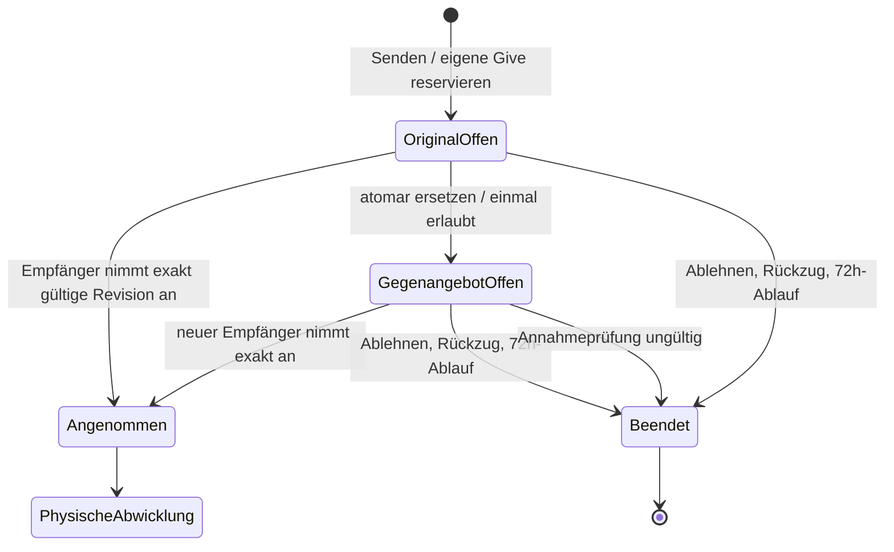

# Trade Lifecycle V1 — Zustandsmaschine und Übergänge

Stand 2026-10-06; nur Fachmodell. Maßgeblich: [Vertrag](TRADE_LIFECYCLE_V1_CONTRACT.md). Zustandsnamen sind fachliche Bezeichner, keine beschlossenen SQL-Enums. Offene Entscheidung Dxx bedeutet ausdrücklich **kein freigegebener Implementierungsdefault**.

## 1. Orthogonaler Zustand statt monolithischer Statusspalte

Stabile Teilnehmer A/B; physische Richtungen A→B und B→A. Aktueller Angebotssender kann beim Gegenangebot wechseln. `accepted_proposer` bewahrt die maßgebliche Perspektive der akzeptierten Mengenregeln unabhängig von aktueller Aktion/Sessionrolle.

| Teilmodell | Zustände / Daten | Bedeutung |
|---|---|---|
| Verhandlung | `ORIGINAL_OPEN`, `COUNTER_OPEN`, `ACCEPTED`, `DECLINED`, `WITHDRAWN`, `EXPIRED`, `INVALIDATED` | Je Verhandlung höchstens ein aktives Angebot. Alte Angebotsrevision zusätzlich `SUPERSEDED`; Zähler 0/1 für Gegenangebot. |
| Vereinbarung | aktuelle angenommene Version, exakte Positionen, Regelkontext, beidseitige Zustimmung | Ein Amendment-Vorschlag ist noch keine neue wirksame Vereinbarung. |
| Amendment | `NONE`, `PROPOSED`, `ACCEPTED`, `REJECTED`, `WITHDRAWN` | Nur Reduktion vor physischer Bewegung. Proposed blockiert Versand/Adress-Neufreigabe bis Klärung; kein Abgang auf unklarer Version. |
| Eigene Vorbereitung A/B | `NOT_STARTED`, `PREPARING`, `PREPARED`; Deadline/Overdue separat | Packliste, Vollständigkeit und eigenes gültiges Foto-Paket. Kein Bestandswrite. |
| Kontrollpaket je Absender | Revision, zugehörige Dealversion, Fotoobjekte, `PRIVATE_DRAFT` / `SHARED_FOR_REVIEW` / `HIDDEN_FROM_NORMAL_VIEW` | Gegenseitige Sichtbarkeit erst bei beidseitiger Vorbereitung. Speicherlöschung getrennt. |
| Review je Prüfer über Gegenpaket | `NOT_AVAILABLE`, `PENDING`, `CONFIRMED`, `PROBLEM`, `STALE` | Bestätigung immer auf konkrete Deal-/Fotopaketrevision. |
| Adresse je Inhaber | `MISSING`, `SELECTED`; gewählter Snapshot; Freigabeereignis | Gegenseitige Freigabe als atomare Paarbarriere, keine bloße globale Checkbox. Widerruf D05. |
| Physische Richtung | eigener Versand erklärt ja/nein; Versandnachweisquelle; Zeitpunkt der Erklärung; tatsächliche Ankunft; Mengenbuchungen | Wirksame Projektion `NOT_SENT`, `SENT`, `ARRIVED`; `ARRIVED` ohne Absenderversandklick ist erlaubt. |
| Empfang je Empfänger | `EXPECTED`, `ARRIVED_UNCHECKED`, `CHECKED_OK`, `PARTIAL_OR_PROBLEM`, `NOT_ARRIVED_REPORTED`, `RECONCILIATION_REQUIRED`, `SETTLED_OK`, `SETTLED_WITH_PROBLEM` | Fachlich geprüfte Teilmengen und offene Differenzen getrennt von der Ankunft. |
| Problemfall | Typ, betroffene Richtung/Position/Menge, `OPEN`, `CORRECTION_PENDING`, `RESOLVED`, `ADMIN_CLOSED` | Foto-, Versand- und Empfangsprobleme nicht vermischen. Autorität für Admin D09. |
| Bewertung je Person | `NOT_ELIGIBLE`, `ELIGIBLE`, `SUBMITTED_BLIND`, `WINDOW_EXPIRED`, `PUBLISHED` | Zeit und Publikation unabhängig vom Tradeabschluss; D07 für Grenzfälle. |
| Zeit-/Auditdimension | fällige Phasen, Dedupe-Reminder, Überziehung, Korrekturereignisse | `OVERDUE` ist Zusatzmerkmal, kein automatischer Paket-/Bestandswechsel. |

`CHECKED_OK` und `SETTLED_OK` können in einem atomaren Übergang zusammenfallen, sofern keine offene Buchungsdifferenz besteht. Getrennte Benennung erklärt, warum reine Prüfung bei Reconciliation noch kein abgeschlossener Mengenabgleich ist.

## 2. Globale Anzeige ist abgeleitet

| Anzeige | Ableitung |
|---|---|
| Offene Anfrage / Gegenangebot | Aktuelle offene Verhandlungsrevision, noch nicht angenommen. |
| Angenommen / Vorbereitung | Accept gespeichert, Pack-/Kontrollbarriere noch nicht erfüllt. |
| Wartet auf Gegenseite | Eigener erforderlicher Schritt erledigt, fremder noch offen; rollenbezogen. |
| Fotokontrolle / Kontrollproblem | Pakete freigegeben und Review offen/problematisch. |
| Dealänderung prüfen | Amendment PROPOSED auf noch unverändert geltender angenommener Version. |
| Adressfreigabe / Versandbereit | Zwei gültige Reviews + zwei bestätigte Adresssnapshots; Paarfreigabe gespeichert. |
| Teilweise / beidseitig versendet | Eine/beide Richtungen haben physischen Versandnachweis; nicht automatisch empfangen. |
| Teilweise empfangen | Mindestens eine Ankunft/Teilprüfung; Gegenrichtung oder Mengenklärung noch offen. |
| Empfangsproblem / nicht angekommen | Entsprechender richtungsbezogener offener Fall. |
| Teilweise abgeschlossen | Genau eine Richtung vollständig geklärt. |
| Vollständig abgeschlossen | Beide Richtungen geklärt, keine offenen Probleme/Reconciliation. Bei problematischer Klärung qualifiziert kennzeichnen. |
| Administrativ/problematisch geschlossen | Ausdrückliche qualifizierte spätere Entscheidung nach D09, kein normaler Erfolg. |

Die Anzeigepriorität darf keine zugrundeliegenden Fakten überschreiben: „Problem“ blendet z.B. nicht aus, dass A bereits versendet hat. Eine automatische einwertige Zustandskette würde erlaubte Kombinationen verlieren.

## 3. Verhandlung

Ein neues Berechnen nach Beendigung erzeugt nur auf ausdrücklichen Nutzerbefehl einen neuen Vorgang; kein Pfeil zurück in dieselbe Verhandlung.

## 4. Übergangstabelle

Jeder schreibende Übergang benötigt autorisierten Akteur, erwartete aktuelle Version, atomare Preconditions und idempotente Commandidentität. Nicht aufgeführte Zustandswechsel sind nicht automatisch erlaubt. „Keine Buchung“ meint keine Änderung physischer Inventarmengen; Holds/Audit können sich trotzdem ändern.

| ID / Befehl | Akteur und Guard | Ergebnis / atomare Wirkung |
|---|---|---|
| T01 Anfrage senden | Angebotsersteller; frischer genauer Deal gültig, ausgehend offen <3, eigene Give frei | ORIGINAL_OPEN; Snapshot/72h/Commandresult speichern, nur eigene Give halten und eigene Receive-Mengen claimen. Keine physische Buchung. |
| T02 Original annehmen | aktueller Empfänger, now < Deadline, aktuelle Revision, genaue Revalidierung gültig | ACCEPTED; fremde Give zusätzlich halten, Senderholds übernehmen, Version fixieren, initiale Packdeadline. Offener Anfragezähler sinkt. |
| T03 Original ungültig beim Annahmeversuch | Empfänger; konkrete Prüfung fehlgeschlagen | Keine Annahme/Teilreparatur; Angebot bleibt bis explizitem Ausgang offen. Aktualisierungsvorschau möglich, noch kein neues Angebot. |
| T04 Gegenangebot senden | bisheriger Empfänger; Original offen/unabgelaufen, Zähler 0, eigene offene Quote <3, neuer genauer Deal gültig und bewusst geprüft | Atomarer Wechsel: Original superseded, alte Holds und Claims frei, neue eigene Give gehalten und eigene Receive-Mengen geclaimt, Zähler 1, neue 72h. |
| T05 Gegenangebot annehmen | ursprünglicher Sender als aktueller Empfänger; frische genaue Prüfung gültig | Wie T02; Mengenperspektive des angenommenen Gegenangebots fixieren. |
| T06 Gegenangebot ungültig | aktueller Empfänger versucht Annahme; konkrete Prüfung ungültig | INVALIDATED, zugehörige Holds und Claims frei; keine weitere Revision. Keine Buchung. |
| T07 Ablehnen | aktueller Empfänger einer offenen, nicht angenommenen Revision | DECLINED, zugehörige Holds und Claims frei, optional Nachricht; keine Negativbewertung. |
| T08 Zurückziehen | aktueller Sender vor Annahme | WITHDRAWN, Holds und Claims frei. Kein Widerruf einer bereits angenommenen Bindung über diesen Befehl. |
| T09 Anfrage ablaufen | System/autorisiertes Lazy-Sweep; exakt aktive offene Revision, now >= expires_at | EXPIRED, nur deren Holds und Claims frei. Race mit Accept über dieselbe Grenze serialisieren. |
| T10 Packen / Foto-Draft | jeweiliger Absender; angenommen, aktuelle Version, eigene Richtung noch nicht physisch bewegt | Eigene Vorbereitung/Fotos; private Drafts. Keine Inventarbuchung, keine Partneradressanzeige. |
| T11 Vorbereitung bestätigen | jeweiliger Absender; eigene Packliste vollständig, ausreichendes Foto-Paket erklärt | PREPARED. Sind beide aktuell vorbereitet: beide Pakete gemeinsam SHARED_FOR_REVIEW. |
| T12 Foto bestätigen | Gegenpaket-Prüfer; geteilte aktuelle Revision, gültiger eigener Adresssnapshot, informierte Bestätigung | Eigenes Review CONFIRMED; sind beide Reviews und Adressen gültig: T18 innerhalb derselben serialisierten Freigabegrenze. |
| T13 Kontrollproblem melden | Gegenpaket-Prüfer | Review PROBLEM mit Gründen/Positionen; keine automatische Beendigung, keine Adressfreigabe. |
| T14 Kontrollpaket korrigieren | betroffener Paketinhaber; keine physische Bewegung, aktuelle Version | Neue Fotorevision, abhängiges Review STALE/PENDING; erneute ausdrückliche Prüfung. Kein altes CONFIRMED weiterverwenden. |
| T15 Reduktion vorschlagen | Teilnehmer vor physischer Bewegung; konkrete Teilmengen/Balance geprüft | Amendment PROPOSED; Zustimmung des Vorschlagenden zur exakten Revision, alter Snapshot/Holds weiter gültig. Versand pausiert. |
| T16 Reduktion zustimmen | anderer Teilnehmer; Proposal noch aktuell, keine physische Bewegung, frische Mengen-/Sicherheitsprüfung im eingefrorenen Regel-Snapshot | Neue Vereinbarungsversion; Holds atomar reduzieren; betroffene Vorbereitung/Reviews entwerten; Fristen D04. |
| T17 Reduktion ablehnen/zurückziehen | anderer Teilnehmer lehnt ab / Vorschlagender zieht nur sein Proposal zurück | Proposal beendet, kein Paketwechsel. Alte Bindung nicht automatisch canceln. Vollständiges Beenden eigener Übergang T19. |
| T18 Adressen freigeben | System als Folge beider gültigen Fotobestätigungen, beide Adressen feststehend, kein offenes Amendment | Beide Zugriffsrechte atomar, Releasezeit und Versanddeadline +72h; aktuelle Version READY_TO_SHIP. Keine physische Buchung. |
| T19 Angenommenen Trade vor Versand beenden | autorisierter Beteiligtenbefehl; genaue Ein-/Beidseitigkeit D04; nirgends physische Bewegung | CANCELLED_AFTER_ACCEPTANCE; noch nicht verbrauchte Holds frei; Audit. Fehlbestandskorrektur D06 nicht vergessen. Keine automatische Bewertung. |
| T20 Eigenen Versand endgültig bestätigen | jeweiliger Absender; eigene aktuelle Richtung versandbereit, Confirm erteilt, kein offenes Amendment | Eigene genaue Give einmal abbuchen, Holds atomar überführen, Selbstauskunft dokumentieren. Gegenrichtung bleibt gehalten/offen. |
| T21 Pack-/Versandfrist überschreiten | Systemzeit; betreffender Schritt offen | OVERDUE + Audit/To-do; kein Mengenwrite/normaler Abbruch. Packfrist betrifft nur eigene Vorbereitung (00A/D03); keine automatische Prüfabbruchfrist. Korrekturfristen D04. |
| T22 Physische Ankunft melden | jeweiliger Empfänger, angenommener Trade; kein SHIPPED-Guard | ARRIVED_UNCHECKED; Zeit/Nachweis festhalten, normale Änderungen/Cancel sperren; noch keine pauschale Vollgutschrift. Historischer Planungsschritt; in L07 kein separater Ankunftscommand. Verbindliche Empfangsbuchung erst nach beidseitiger Vorbereitung, Fotoprüfung und Adressfreigabe (Entscheidung 11.10.2026). |
| T23 Alles geprüft und akzeptiert | Empfänger; aktuelle bindende Revision, beidseitige Vorbereitung/Fotoprüfung/Adressfreigabe, echte Ankunft, noch ungebuchte Mengen | Fehlende reale Abgänge bei Receipt-Evidence und akzeptierte Zugänge genau einmal atomar; SETTLED_OK, sofern keine Reconciliation. Ratingberechtigung. |
| T24 Teil-/Problemempfang bestätigen | Empfänger; aktuelle bindende Revision, beidseitige Vorbereitung/Fotoprüfung/Adressfreigabe, prüfbare Mengenpartition | Nur neue akzeptierte Mengen buchen; PARTIAL_OR_PROBLEM; offene Restmengen. Fehlenden Abgang der vollständigen bindenden Give-Mengen atomar gemäß L07-Entscheidung vom 11.10.2026 nachführen, Richtung versendet/angekommen; unklare Restmengen explizit in Reconciliation. |
| T25 Nichtankunft melden | Empfänger dieser Richtung; keine Ankunft, now >= sender_confirmed_at+7 Tage | NOT_ARRIVED_REPORTED/Problem; keine Buchung und kein Restore. |
| T26 Doch angekommen | Empfänger nach T25; tatsächliche Ankunft | T22/T23/T24; Verlustmeldung bleibt Audit, keine automatische Vollbuchung. Bei Adminabschluss D09. |
| T27 Weitere echte Mengen / Schaden akzeptieren | Empfänger; zugehöriger offener Problemfall, Menge noch ungebucht und physisch vorhanden | Nur bestätigtes zusätzliches Delta; bei vollständig geklärten Differenzen qualifizierter Richtungsabschluss. Keine pauschale Vollmenge durch „gelöst“. |
| T28 Problem administrativ klären | spätere berechtigte Rolle/Entscheid, D09 | Qualifizierter Abschluss/Restmengenentscheidung mit Audit; kein erfundener Eingang oder Restore. Vor D09 keine Implementierung. |
| T29 Gesamtabschluss projizieren | System nach gültiger Richtungsänderung | Beide geklärt → abgeschlossen mit Ergebnisqualität; sonst aktiv/teilweise geklärt. Kein Ratingzwang. |
| T30 Bewertung abgeben | Empfänger nach eigener Prüfung; individuelle Frist offen, gültige Sterne/Tags | Einmalige Zuordnung zur Gegenseite, zunächst blind. Nicht auf Gegenrichtung warten. Finalität/Edits D07. |
| T31 Bewertungen veröffentlichen | System; beide abgegeben ODER tatsächlich abgelaufene individuelle Gegenfrist | Publikation inklusive Aggregate; nie vor Guard. Unbegonnene Frist bleibt offen nach D07. |
| T32 Reminder fällig | System; noch offene relevante Phase/Revision, Schwelle erreicht, nicht bereits erzeugt | Dedupliziertes Ereignis; kein Phasenwechsel/Mengenwrite. |

T12 und T18 müssen gegen parallele Foto-/Adressänderung abgesichert sein. T22 kann ohne T18 auftreten, weil physische Realität nicht an einen fehlenden UI-Schritt gebunden ist; daraus wird **keine** rückwirkende Kontroll- oder Adressberechtigung abgeleitet.

## 5. Erlaubte ungewöhnliche Kombinationen

- A bestätigt vollständigen Empfang; B hat nie Versand geklickt. A→B kann weiterhin unversendet sein. B→A ist physisch angekommen, nicht „vom Absender bestätigt“. Bestandsdelta genau einmal, Nachweisherkunft separat.
- A hat versendet, B ist pack-/versandüberfällig. A-Give aus Bestand, B-Give gehalten; kein reguläres Cancel.
- A hat 29/30 akzeptiert, B hat A-Paket vollständig erhalten: eine Richtung SETTLED_OK, eine PARTIAL_OR_PROBLEM; global weiter aktiv.
- A bewertet nach eigener Prüfung, sein Brief ist noch unterwegs: Bewertung SUBMITTED_BLIND, Trade noch aktiv.
- Foto-Problem mit altem Kontrollpaket, keine Adresse offengelegt: Korrektur möglich, keine automatische Auflösung.
- Adressen waren bereits sichtbar, dann pre-shipment Amendment: vorherige Offenlegung bleibt Fakt; alte Fotos/Bestätigungen legitimieren keine geänderte Packung. Address-Revisionspolitik D05.
- „Nicht angekommen“ gefolgt von „Doch angekommen“: beide Ereignisse im Audit; nur echte Zugänge, keine Rückabwicklung des Senderabgangs.

## 6. Ereignisse für spätere Projektionen

Mindestens modellierbar: OfferSent, OfferCountered, OfferAccepted/Declined/Withdrawn/Expired/Invalidated, ReservationHeld/Released/Consumed, PreparationConfirmed, BothPackagesVisible, PhotoProblemReported, ControlPackageRevised, PhotoConfirmed, AmendmentProposed/Accepted/Rejected, AddressesReleased, PhaseReminderDue, PackingOverdue, ShippingOverdue, ShipmentDeclared, ArrivalReported, ReceiptInspected, InventoryDepartureBooked, InventoryArrivalBooked, ReconciliationRequired, DeliveryProblemReported, NotArrivedReported, LateArrivalReported, DirectionSettled, TradeCompleted, TradeClosedWithProblem, RatingSubmitted, RatingPublished.

Events enthalten IDs/Revisionen/Akteur/serverseitige Zeit und notwendige Mengenreferenzen; keine Adress-/Fotoinhalte oder blinden Sterne in allgemein sichtbaren To-dos/Logs. Domainereignis, persistierter Zustand und zugestellte Notification sind drei verschiedene Dinge. Kein Event darf rückwirkend einen fremden Akteur vortäuschen.

## 6. Verbindliche Präzisierung 00A

Annahme persistiert neben der Dealversion den eingefrorenen Regel-Snapshot (§6a des Vertrags). Reduktionen benutzen ihn; globale spätere Cross-/Pool-Änderungen invalidieren keinen angenommenen Deal. Die aktuellen physischen Mengen und Command-Berechtigungen bleiben prüfpflichtig.

`prepare_due_at = accepted_at + 72h` endet für die einzelne Seite mit eigener abgeschlossener Vorbereitung inklusive Fotos. Gegenseitige `PENDING`-Reviews sind eine eigene Phase ohne harte automatische Abbruchfrist. Review-Reminder/Eskalationsereignisse sind zulässig; T21 darf daraus keinen Abbruch ableiten.

T22–T24 unterscheiden bloße Ankunft, geprüfte Mengen und wirksame Richtung. Sobald tatsächliche Mengen bestätigt werden, sind fehlender Senderabgang, akzeptierter Empfängerzugang, Holdverbrauch und Richtungsprojektion atomar. `ARRIVED` beinhaltet physisch erfolgten Versand, ohne einen Absenderklick zu fingieren. Spätes/paralleles T20 verwendet denselben Abgangsledger; keine zweite Abbuchung. Bei Teilen/Problemen weder pauschaler Vollzugang noch automatischer Restore.

## 7. Verbindlicher Abschluss 00B

**TRADE-LIFECYCLE-V1 — FACHLICH GESCHLOSSEN.** Keine offene Fachentscheidung blockiert derzeit L01; keine Umsetzung oder Produktionsfreigabe.

Option A: T01 prüft freie eigene Need-Mengen und erzeugt sie zusammen mit eigenen Give-Holds atomar. T04 ersetzt beide Bindungen ohne Zwischenlücke. T02/T05 Accept überführen eigene Pending-Claims in verbindliche eingehende Mengen und binden beide Richtungen; niemals Pending und Accepted doppelt zählen. T06–T09 lösen beim endgültigen Ausgang beide Bindungsarten. T16 reduziert die betroffenen verbindlichen Mengen; T23/T24/T27 überführen tatsächliche akzeptierte Mengen von erwarteten Eingängen in physischen Bestand.

Need-Mengen sind ganzzahlig, nicht binär: bei Gesamtbedarf 2 und Pending-Claim 1 bleibt 1 verfügbar. Aktuelle Revalidierung schützt gegen konkurrierende Send-/Accept-Befehle und zwischenzeitlich weggefallene Partnersupply. Ein eigener Claim blockiert nicht den physischen Partnerbestand. Neuer unveränderlicher Contract-Type; keine Vermischung mit Legacy oder `smartdeal_v1`.

## Fortschreibung L07 vom 11.10.2026

Der frühere D02-Pfad aus PACKING mit nur belegten Teilabgängen ist historisch ersetzt (siehe Fachvertrag §11). T23/T24/T26 buchen ausschließlich nach aktueller beidseitiger Vorbereitung, Fotoprüfung und Adressfreigabe, auch ohne manual_sent. Sender D=E, Empfänger C=akzeptierte Menge; keine Rückbuchung. L07 setzt nur Richtungszustände, noch kein Rating und keinen Gesamtabschluss. T27 und administrative Problemauflösung sind nicht implementiert. L08 muss bei endgültiger Problemauflösung unerfüllte Restclaims freigeben oder fachlich abschließen.
